# MetIDTracker User Manual

## Overview

MetIDTracker is intended to be used as a tool for collaborative annotation of LC-MS/MSMS data. It is developed to improve the identification confidence in untargeted metabolomics experiments but may also be used to annotate other kinds of MS/MSMS data.

The system includes two components - the software with graphic user interface and the database. The database serves as a repository for reference data (compound database, MSMS libraries, etc.), experimental results (MS and MSMS spectra), and metadata (sample description, experimental conditions, instrument methods, etc.). Multiple users may access the same database and collaborate on the annotation of spectra.

## Basic operations

It is highly recommended to run the software on a computer with at least 16GB RAM and to use a large high-resolution monitor (24" or more).

### Staring the program

To start MetIDTracker double-click StartMetIDTracker.bat file inside the MetIDTracker... folder. Software distribution includes its own version of Java runtime, so it doesn't matter if you have Java installed on your computer or not. By default, maximum RAM allocation for the program is set to 8GB. If your computer has RAM smaller than 12GB you may want to reduce memory allocation to MetIDTracker by editing HEAP_SIZE variable in the StartMetIDTracker.bat file before starting the program. The software was not tested with memory allocation of less than 4GB, however.

#### Establishing connection between MetIDTracker and database

During program startup it will try to establish connection with the database using the settings from preferences. If this fails (e.g. during the first time you run the program, when database location and credentials were not provided yet), Database connection setup dialog is displayed ([Fig. 1](#db_conn_setup_dialog)).

{#db_conn_setup_dialog}

Edit host name, port, user, and password fields to match the parameters of your database configuration (SID/database and schema are determined by the database dump you've used at the previous steps and should not be changed). Click "Test connection" ([Fig. 2](#db_connection_test_dialog)) button to verify that database connection can be established using the parameters in the form. Click "Continue program startup" to save the connection parameters and launch the program.

{#db_connection_test_dialog}

Database connection parameters are stored in program preferences and unless the database can not be accessed (because it is down or there are network issues) or access credentials are changed, the connection will be established automatically, and Database connection setup dialog will not be shown.

While the program is starting up it will display the splash screen with the program version and build date ([Fig. 3](#startup_splash)).

{#startup_splash}

Current startup operation is displayed in blue at the bottom of the splash screen "Initializing user interface" stage may take some time (half a minute or more, depending on the available CPU resources and RAM).

#### Logging into the database

MetIDTracker is a collaborative environment, and each user must provide his/her personal credentials to access and annotate the data. In the fresh installation there is a single user in the database with username "admin" and password "admin" (no quotations). Admin user may create other users with administrative or regular access, and it is recommended to change the admin password during the first program run.

At every program startup the login dialog is presented ([Fig. 4](#login_dialog)). You must be logged in in to use the software.

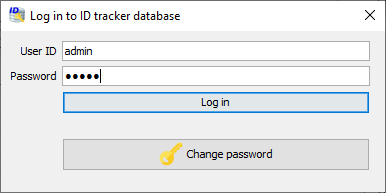{#login_dialog}

Users may change their passwords. To do that, click "Change password" button on the login dialog, fill all the information in the "Change password" dialog ([Fig. 5](#change_password_dialog)) and click "Change password" button to confirm the change. Enter new password in the login dialog and click "Log in".

{#change_password_dialog}

Once you log in, the software will fetch the necessary data from the database (progress dialog will be displayed during that time). Your name and user icon will show as the first item of the "Database access" menu. If you log in as a user with administrative privileges, {height="24px" width="24px"} icon is replaced by {height="24px" width="24px"} (superuser), and "Show user manager" and "Show organization manager" items on the "Database access" menu are activated.

### Managing system users

If you log in as a user with administrative privileges, you will be able to access the User Manager ([Fig. 6](#user_manager_dialog)) through the "Database access" menu. Use icons on the panel toolbar to create, edit or delete the users. "Create User" and "Edit User" dialogs ([Fig. 7](#user_editor_dialog)) are identical, except "Edit User" dialog is pre-populated with the data for user selected in the User Manager. All fields must be populated with data. Every user has to be associate with organization (see the section below).

{#user_manager_dialog}

{#user_editor_dialog}

### Managing organizations

MetIDTracker is developed as a part of a larger software package adapted to the needs of the service lab, so the underlying database requires some additional structured information about the users. Organization Manager ([Fig. 8](#organization_manager_dialog)), available for users with administrative access, allows users to add or edit this information. You may open Organization Manager through the "Database access" menu.Use icons on the panel toolbar to create, edit or delete the organizations.

{#organization_manager_dialog}

"Add New Organization" and "Edit Organization" dialogs ([Fig. 9](#organization_editor_dialog)) are identical, except the "Edit Organization" dialog is pre-populated with the data for organization selected in the Organization Manager. All fields must be populated with data.

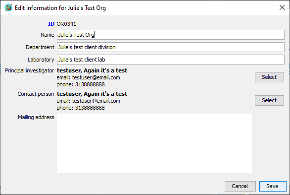{#organization_editor_dialog}

### General notes about Graphical User Interface

#### Rearranging panels

The user interface is based on DockingFrames library (www.docking-frames.org). It allows for flexible customization of the working area based on user preferences, preserving the layout between the sessions, and using more than one computer monitor for data analysis.

{#df_panel_controls}

Panel controls used in the new GUI are shown on [Fig. 10](#df_panel_controls). The horizontal bar (1) allows to minimize any panel to a small bar with icon, panel name and "restore" button (4). The corner button (2) allows to toggle the panel between its current size maximized within its parent panel. The detach/attach button (3) is present only on major panels ("MetIDTracker workbench", "MetIDTracker LIMS", "Raw data examiner", "Databases"). It allows the user to use the whole panel as a separate program window that may be moved to the second monitor.

All major panels may be rearranged inside the main program window and all smaller panels inside each of the major panels may also be rearranged according to user preferences. Moving the panel is achieved by clicking on its title tab (5) and dragging it to the desired location. Legitimate locations are highlighted by the blue frame and panel will snap to the new position when you release the mouse button ([Fig. 11](#df_rearrange_panels)).

{#df_rearrange_panels}

Layout of all program windows is preserved between sessions (program will re-open with the layout it when last closed). User may show/hide major program panels using "Panels" menu ([Fig2.12](#global_panels_menu)).

{#global_panels_menu}

All top-level panels include the menu bar with the last menu "Panels" which allows to select which sub-panels of the panel are visible and which are hidden ([Fig. 13](#sub_panels_menu)). They also have an additional icon next to panel controls to call the popup menu for all the commands associated with the panel ([Fig. 14](#panel_commands_menu)).

{#sub_panels_menu}

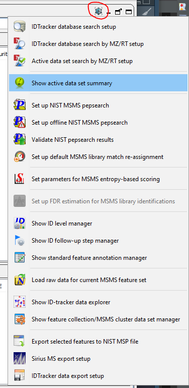{#panel_commands_menu}

#### Progress dialog

The progress dialog serves several purposes: it allows the user to monitor the execution of long tasks (database search, library search, etc.), it prevents the user from interacting with the program when the tasks that require heavy computations are running, and it allows the user to interrupt the long running tasks if necessary using commands from the context menu ([Fig. 15](#progress_dialog)). Maximal allowed number of concurrent running tasks is defined in the general preferences.

{#progress_dialog}

## MetIDTracker LIMS system

LIMS stands for Laboratory Information Management System. Its purpose is to provide a database back end and friendly user interface for managing multiple kinds of data associated with MSMS experiments ([Fig. 16](#tracker_lims_panel)).

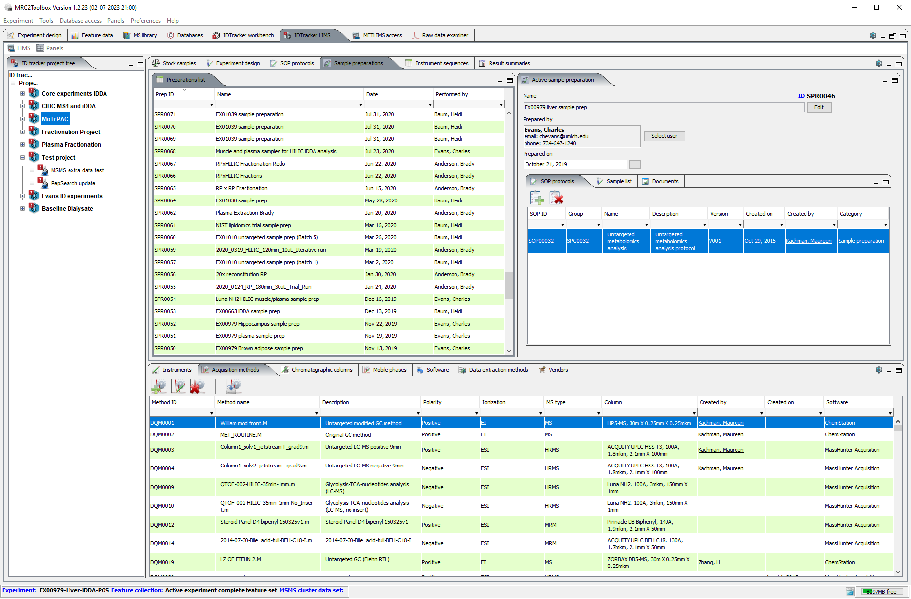{#tracker_lims_panel}

### Projects and experiments

#### Project configuration

Projects allow the grouping of related identification experiments. Every experiment has to be associated with the project. To create the new project, go to "LIMS" menu of the "MetIDTracker LIMS" panel and select "New MetIDTracker project" command to display the Project Editor Dialog ([Fig. 17](#tracker_project_editor)).

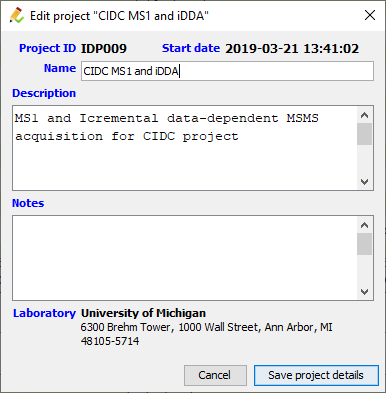{#tracker_project_editor}

The name is obligatory, description and notes are optional, Project ID, start date and laboratory are populated automatically based on the currently logged-in user data.

To edit project information, select it in the tree, right-click and choose "Show Edit compound identification project" from the popup menu ([Fig. 18](#project_context_menu)).

{#project_context_menu}

#### Experiment configuration

There are two different ways to create the MetIDTracker experiment and upload data to the database. One is specific for Agilent platform and is using the vendor software for feature extraction. Another is vendor-agnostic as long as vendor raw data file format may be converted to mzML or mzXML format and is using MetIDTracker built-in processing module. Agilent-specific workflow was originally developed due to the fact that this is our lab primary platform and it includes the tools for MSMS feature extraction and identification.The details for this workflow are covered in the corresponding tutorial. Whichever way the experiment was created, once it is uploaded to the database it can be managed through MetIDTracker LIMS. To edit some basic experiment information, select the experiment in the tree, right-click and choose "Show Edit compound identification project" from the popup menu ([Fig. 19](#tracker_experiment_context_menu)) to show Experiment Editor Dialog ([Fig. 20](#tracker_experiment_editor_dialog)).

{#tracker_experiment_context_menu}

{#tracker_experiment_editor_dialog}

### Data acquisition and analysis

#### Vendor manager

Vendor manager ([Fig. 21](#vendor_manager_panel)) allows the user to enter and edit ([Fig. 22](#vendor_editor)) some basic information about the hardware and software manufacturers. These data are required to properly track instruments, software and a number of other items in the LIMS.

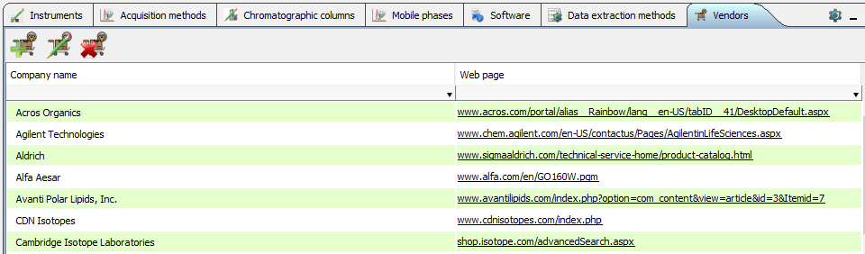{#vendor_manager_panel}

{#vendor_editor}

#### Instrument manager

Instrument manager ([Fig. 23](#instrument_manager_panel)) allows the user to enter and edit some basic information about the LC-MS and GC-MS instruments used to perform the analysis ([Fig. 24](#instrument_editor_dialog)).

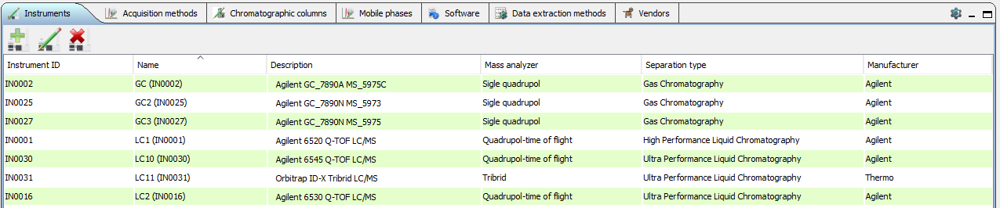{#instrument_manager_panel}

{#instrument_editor_dialog}

#### Chromatographic columns manager

Chromatographic columns manager ([Fig. 25](#chromatographic_column_manager)) allows the user to keep an inventory of columns used for sample separation - add, edit ([Fig. 26](#chromatographic_column_editor)), delete columns.

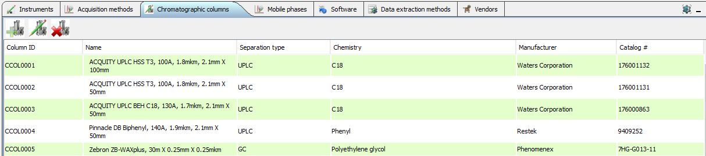{#chromatographic_column_manager}

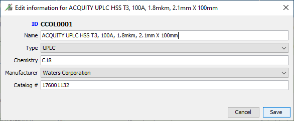{#chromatographic_column_editor}

#### Mobile phase manager

The mobile phase manager [Fig. 27](#mobile_phase_manager) keeps an inventory of mobile phases used for the chromatographic separation of compounds and allows to add, edit ([Fig. 28](#mobile_phase_editor)) or delete mobile phase components.

{#mobile_phase_manager}

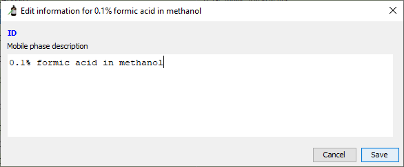{#mobile_phase_editor}

#### Software manager

Software manager ([Fig. 29](#software_manager_panel)) allows the user to enter and edit ([Fig. 30](#software_editor)) some basic information about instrument control and data analysis software. It is required to properly define and track data acquisition and data analysis methods in the LIMS.

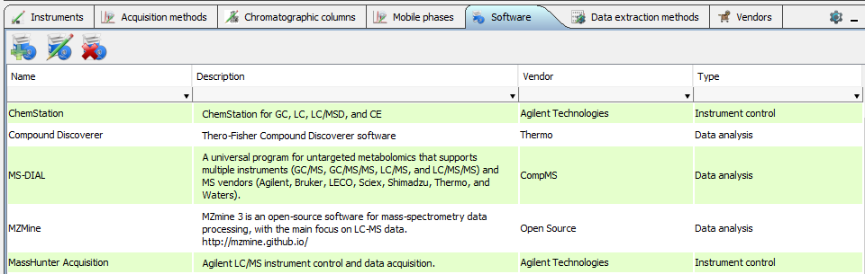{#software_manager_panel}

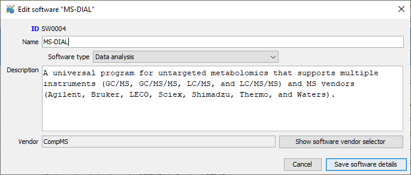{#software_editor} Part of software definition is vendor selection through vendor selector dialog ([Fig. 31](#vendor_selector)).

{#vendor_selector}

#### Data acquisition method manager

Data acquisition method manager ([Fig. 32](#data_acquisition_method_manager)) is intended to maintain the list of instrument (LC-MS and GC-MS) methods. Method files are stored in the database together with some descriptive information and may be downloaded for re-use in new studies.

{#data_acquisition_method_manager}

Data acquisition method editor ([Fig. 33](#data_acquisition_method_editor)) allows the user to specify several parameters for the method. Gradient and mobile phase definition are not fully implemented yet, so the corresponding panels are hidden on the figure. For definition of the new method all fields are obligatory.

{#data_acquisition_method_editor} Part of acquisition method definition is software selection through software selector dialog ([Fig. 34](#software_selector)).

{#software_selector}

#### Data extraction method manager

Data extraction method manager ([Fig. 35](#data_extraction_method_manager)) is intended to maintain the list of vendor or third-party methods used to extract MS and/or MSMS data from raw data files. Method files are stored in the database together with some descriptive information and may be downloaded for re-use in new studies.

{#data_extraction_method_manager}

Data extraction methods are highly diverse and difficult to classify in a meaningful way, so only a field for free-form description is provided ([Fig. 36](#data_extraction_method_editor)).

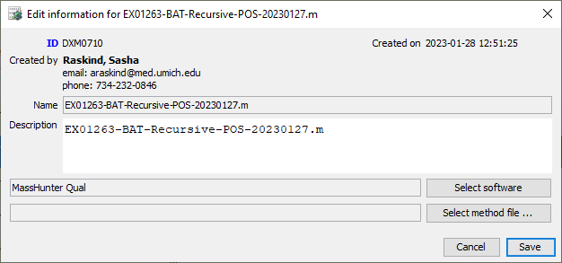{#data_extraction_method_editor}

#### SOPs and protocols manager

The SOPs and protocols manager ([Fig. 37](#sops_manager_panel))maintains a library of standard procedures and protocols of different categories. Documents are stored in the database together with some descriptive information and may be downloaded as needed.

{#sops_manager_panel}

To upload new or edit existing SOP document use SOP/Protocol editor ([Fig. 38](#sop_editor)). Protocol name, category, description, and document file must be specified to define a new protocol. Other fields are auto-populated . If the document file is specified when editing the protocol, it will replace the document currently associated with the protocol ID.

{#sop_editor}

#### Stock samples manager

Compound identification experiments are often performed using multiple aliquots of the same sample for analysis under different chromatographic and MSMS conditions. Stock samples manager ([Fig 2.39](#stock_sample_manager_panel)) is designed to maintain the list of these samples.

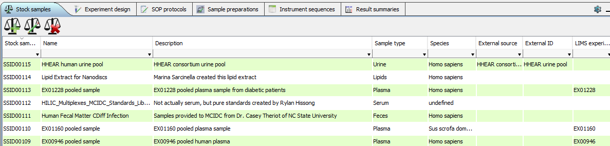{#stock_sample_manager_panel}

To define the new stock sample it is necessary to specify name, description, type and species ([Fig. 40](#stock_sample_editor)).

{#stock_sample_editor}

Sample types are selected ([Fig. 41](#sample_type_lookup_dialog)) from the list based on [NCBI MESH term list](https://www.ncbi.nlm.nih.gov/mesh/).

{#sample_type_lookup_dialog}

Species are selected ([Fig. 42](#species_lookup_dialog)) from [NCBI taxonomy list](https://www.ncbi.nlm.nih.gov/taxonomy).

{#species_lookup_dialog}

## Raw Data Examiner

Raw Data Examiner panel [Fig. 43](#raw_data_examiner_panel) provides the basic functionality to explore the raw MS and MSMS data.It works both with arbitrary mzML and mzXML files and in the context of compound identification experiment (!!ref).

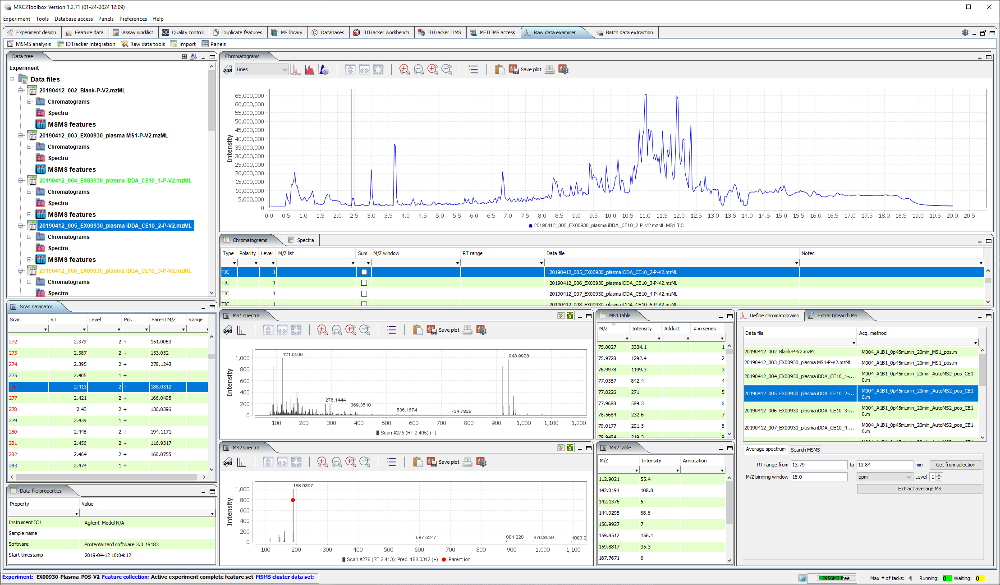{#raw_data_examiner_panel}

### Data tree panel

Data tree panel ([Fig. 44](#raw_data_file_tree)) shows the currently loaded raw data files and chromatograms / spectra linked to them.

{#raw_data_file_tree} 

Control buttons at the right side of the panel header allow to expand / collapse Cromatogram and Spectra tree nodes ({height="24px" width="24px"} / {height="24px" width="24px"}), and toggle between grouping tree nodes by file or by data type ({height="24px" width="24px"} / {height="24px" width="24px"}).
Other sub-panels of the Raw Data Examiner will show relevant information depending on which data tree node is selected.

### Scan navigator panel

Scan navigator panel ([Fig. 45](#raw_data_scan_navigator_panel)) is listing the scans for the currently selected raw data file. It lists scan number, retention time, MS level, polarity. For MSMS scans it also lists parent ion M/Z and isolation window (Range). All table columns allow sorting and filtering. Clicking on MS1 scan will display it on MS1 spectra plot and in MS1 table ([Fig. 46](#msOne_spectra_plot_and_table)). If there are any child MSMS scans associated with currently selected MS1 scan, the first MSMS scan following MS1 will display on MS2 spectra plot and in MS2 table ([Fig. 47](#msTwo_spectra_plot_and_table)). Clicking on MSMS scan will display it together with parent MS1 scan on the corresponding plots and tables.  

{#raw_data_scan_navigator_panel}

{#msOne_spectra_plot_and_table}

{#msTwo_spectra_plot_and_table}

### Data file properties

Data file properties panel ([Fig. 48](#raw_data_file_properties_panel)) is listing the properties of raw data file as recorded in mzML / mzXML. 

{#raw_data_file_properties_panel}

#### Toolbar buttons

From left to right:

-   Expand/collapse the tree
-   Group tree by data file or object type (chromatogram, spectra, etc)
-   Open data files - open any mzml or mzxml file(s) in any folder
-   Close data files - close one or more of the opened raw files
-   Convert original instrument raw data files to mzml and put the converted files into the repository

When raw data files are opened, TIC is extracted automatically

To use the raw data conversion you will need to specify the location of msconvert.exe file in the preferences (see picture above). Msconvert is part of the ProteoWizard package and may be downloaded [here](http://proteowizard.sourceforge.net/download.html)

### Extracting chromatograms

To extract chromatograms:

-   Select data files in the table
-   Choose chromatogram type (TIC, BPC or extracted ion)
-   Choose MS level
-   Specify m/z window for XIC extraction
-   Change polarity if necessary (not automated yet)
-   For XIC type in one or more m/z values separated by comma, check "Sum all" if you want cumulative XIC, otherwise separate XICs will be extracted for each mass.
-   If you want to limit RT range, specify lower and upper limits and check "Limit RT range" checkbox
-   Click "Extract chromatograms"

All settings except data file selection are preserved across sessions.

### Extracting average mass spectrum

To extract average MS

Select data file(s)

-   Specify retention range (manually or from selection on the chromatogram panel). To select the range on a chromatogram, hold the "Shift" button, press the left mouse button, drag the mouse across the desired range and release the mouse button. To clear selection shift-click anywhere in the chromatogram panel.
-   Specify m/z window for peak averaging
-   Specify MS level (1 - MS1, 2 - MS2, etc.)
-   Click "Extract average MS"

### Raw data conversion

Toolbar buttons (left to right)

-   Add instrument raw files
-   Remove selected files
-   Remove all files
-   Set output directory

### Integration with MetIDTracker

The two buttons on the tracker workbench toolbar marked in red above are related to the raw data repository. The first is used to index/re-index the raw data files. This will be necessary only if you manually add raw data files to the repository.

Clicking the second button will tell the program to try loading the raw data files for all of the features currently in the MS2 features table. This can be done only if the raw data repository location is correctly defined in the preferences. If any of the required files are not in the repository, the information message will be shown.

### Extracting chromatograms for the selected feature

Highlight the feature in the table, right-click to show the context menu and choose "Extract XIC setup" to show the dialog.

The "Define chromatograms" panel will be populated with all currently opened data files and the source file for selected MSMS features will be highlighted. M/Z for the most intensive peak in the MSMS will be placed in the M/Z values field. Other fields in the form will be populated with the last used values.

"Select masses for extraction" panel will have a list of all peaks in MSMS (intensity of 999 corresponds to parent ion and is not a measured value unless by a very rare chance a real peak has intensity of exactly 999). You may select any combination of M/Z values and send them to the "M/Z values" field by clicking the "Add masses to extract" button at the bottom.

Click the "Extract chromatogram" button to run the process. Once XICs are extracted the software will switch to the "Raw data" panel.

### Raw data repository

The software library used to access the raw data requires converting original instrument files to mzML or mzXML format. The repository for converted files must be created on the local hard drive or accessible network drive. Location of the raw data repository must be specified in the preferences to let the software know where to look for the data files:

## ID tracker workbench

The amount of data in ID tracker and the number of parameters has increased since the original search form was created, and it became apparent that a more comprehensive and flexible searching mechanism was required. At the moment, the search is functional for MS2 data only.

The search form is a separate dialog called by clicking the  button on the tracker toolbar (first on the left side). The dialog has five panels for different search parameter groups. Setting specific values to any parameter on any panel will narrow the search results. You may reset all the parameters on all panels using the "Reset form" button at the bottom of the dialog or reset individual panels using the "Reset to default values" button. All parameters are preserved between search sessions.

Search parameters may be saved and loaded to/from database using the load () and save () buttons on dialog toolbar:

You may either click the "Load selected query ..." button or double-click the line in the table to load the selected parameter set. You may load other user's parameters, but you may delete only those that you created yourself. To create a new set, click  button, give a descriptive name in the dialog and click "Save".

### LC-MSMS related options

On the MZ/RT search panel you can specify the precursor M/Z, one or more fragment masses, polarity, MS depth, collision energy and retention range. As within the original search, checking "Ignore M/Z" will disregard any precursor/fragment data.

### Sample and experiment options

You may limit the search to one or more sample type(s)/experiment(s) by selecting one or more lines in each of the tables. You may sort and filter the tables to find the necessary data. To clear selections click "Reset to default values".

### ID and annotations options

-"Filter by identification status" defaults to "All", but you may change it to select only identified or only unknowns. -"Filter by name or ID" works the same way as in the original search. -"Filter by formula" - search by molecular formula -"Filter by InChiKey" - search by complete InChiKey or by the first section (14 characters before the first dash that encode structure without any stereo information, e.g. D/L, R/S compounds will have the same first 14 characters)

Check "Search all identifications" to search all IDs in the database. If left unchecked, only primary/default IDs will be considered

"Only features with annotation" - limit to features with custom manual annotations (NOT ID levels and follow-up steps)

Select any combination of ID levels and follow-up steps in the corresponding tables

### Data acquisition and data extraction options

Allows multiple selections in each table.

### MSMS Library options

Limit search results to hits from specific MSMS libraries and /or specific library entries (you may use NIST ID, MONA ID etc.).

"Search all matches" will consider all library hits, not only the default IDs.

## Exporting results

### Exporting MSMS features in TAB-delimited format

To export the features first run the search to populate MS2 and/or MS1 feature tables.

Click the button "Show ID tracker data export dialog" (marked above) to call the export setup dialog. The drop-boxes on the top of the dialog allow to select the subset of features to export:

-   MS level - MS1 or MS2

-   Feature subset

    -   All - all features loaded after search was competed
    -   Filtered - only features visible in the table if any of the filters in the table header were used
    -   Selected only - only those selected by the user in the feature table

-   Identification status

    -   All
    -   Identified only
    -   Unknowns only

There are two lists of parameters available for export - feature properties and identification properties. Columns will be created in the export file for all selected fields and data added where available. To change the field selection hold the "Control" button and click on the field to select/deselect. You may reset the selection to default values using the button below the lists. Your current selection will be preserved between sessions.

Use the "Browse" button to set the export file name and location, then click "Export MetIDTracker data" to write out the export file.

### Exporting MSMS features in NIST MSP format

Click on the  button on the MetIDTracker Workbench panel toolbar. If no MSMS features are selected in the table, the prompt will pop up asking whether you want to export all of the features in the table followed by the file explorer to select the export destination. If some MSMS features are selected in the table, only those features will be exported to the specified file.

### Exporting MSMS features in SIRIUS MS format

[SIRIUS](https://bio.informatik.uni-jena.de/software/sirius/) software package provides a set of tools for MSMS interpretation and compound identification through MSMS. SIRIUS results are more reliable when multiple MSMS data for the same compounds are interpreted together (e.g. multiple fragmentation energies). The SIRIUS export function allows the grouping of selected MSMS features by the M/Z of the precursor ion and retention time based on specified tolerances.

Click on the  button on the MetIDTracker Workbench panel toolbar to show the SIRIUS data export dialog (423).

23.23 *SIRIUS data export dialog*

Specify filters to limit the set of features to export and adjust m/z and RT grouping windows if necessary. Choose the destination file and click "Export data". The resulting file in MS format is ready for import into SIRIUS for further analysis.

## ID tracker feature identification parameters

### ID status flags

To consider the cases where feature were identified by automated searches against spectral libraries/databases, but were rejected by manual curation the "Ambiguity" column is replaced by the "ID status" column which has one of the following icons:

 Single active ID

 Single ID, rejected by curator (table cell will have gray border)

 Multiple IDs, one set as default

 Multiple IDs, NONE set as default (table cell will have gray border)

 True unknown

24.24 *How to disable default id*

Right-click anywhere in the identification table and select "Disable primary identification" from the popup (424). The ID radio-button will clear and the icon in the feature table will change accordingly. To assign the ID click on the corresponding radio button in the identification table. The database response is still sluggish, so please wait for GUI to update properly.

24.24 *Identification table popup menu*

### ID certainty levels

ID certainty levels are for internal use and do not have any direct relation to established ID confidence levels specified by different metabolomics consortia. Levels are color-coded for easier visualization, colors are user-specified. The values are assigned not to the feature, but to its default identification. If there is a default ID, the info will be shown both in the feature table and in the identifications table. If the default ID is disabled, the corresponding cell in the feature table will be blank.

#### Managing ID certainty levels

There is a list of pre-defined identification levels. It may be edited and expanded using the Identification Level Manager (425). You may call the manager by clicking the  icon on the MetIDTracker workbench toolbar.

25.25 *Identification Level Manager*

You may add, edit, or delete ID levels steps using the Identification Level Editor dialog (426). To edit or delete the level it should be highlighted in the manager. The editor dialog allows the user to specify name, numerical rank, and color code for the level. The lower the rank, the higher ID confidence.

26.26 *Identification Level Editor dialog*

#### Assigning ID certainty level

Select the identification in the "Identifications" table and right-click to show the popup menu. Select "Set ID confidence level" -> desired level (427).

27.27 *Setting ID confidence level*

### Follow-up steps

#### Managing follow up steps

There is a list of pre-defined follow-up steps. It may be edited and expanded using the Follow-up step manager (428). You may call the manager by clicking the  icon on the MetIDTracker workbench toolbar:

28.28 *Follow-up step manager*

You may add, edit, or delete follow-up steps using the Follow-up Step Editor dialog (429). To edit or delete the follow-up step it should be highlighted in the manager.

29.29 *Follow-up step editor*

#### Assigning follow-up steps to the feature

Select the feature in MS1 or MS2 table and right-click to show the popup menu. Select "Assign follow-up steps to feature" (430) to show the "Edit identification follow-up steps ..." dialog (431).

30.30 *MSMS feature popup menu*

The dialog will show:

31.31 *Edit identification follow-up steps dialog*

If any follow-up steps were already assigned to the feature they will be on the right side. Move items around by selecting them and clicking add/remove buttons in the middle. Click "Save" to send the new selection to the database. If the feature has at least one follow-up step it will be flagged in the "Follow-up" column and assigned steps will be listed in the "Follow-up" table (432).

32.32 *Identification follow-up step display*

### Free form and document-linked annotations

It is possible to attach extended annotations to MSMS features. In annotation manager (433) you may create formatted text annotations that may include pictures and attach documents as annotation (e.g. pdf or PowerPoint).

33.33 *Annotation manager*

To create a new free-form annotation click  icon on the annotation manager toolbar to show "Edit annotation" dialog (434). The editor allows the user to format the text in various ways and add pictures by copying/pasting or selecting a file on the disk.

34.34 *Free form annotation editor*

To attach a document, click the  icon on the annotation manager toolbar to show the "Attach document annotation" dialog (435). Use the "Browse" button to select the document. By default, the title is set to the document file name, but you may change it to a more meaningful name if necessary.

35.35 *Attach document annotation dialog*

Double-click on the annotation in the table to view or edit it. Free-form annotations will be opened in the editor, PDF or PowerPoint documents will open in a built-in viewer.

To download the annotation document, select it in the table and click the  icon on the annotation manager toolbar.

### Standard annotations

Standard forms of annotation (ID level and follow-up steps) can be applied only to the identified features since they are associated with feature ID but not with the feature itself. Unknown features may be annotated by typing in free form comments, but it is time consuming and more difficult to search and summarize later. For this reason, MetIDTracker includes an option to add "Standard annotations" to any feature regardless of identification status. It works the same way as "Follow-up" steps. To add one or more standard annotations select the feature in the table, right-click to display the context menu and select "Assign standard feature annotations to feature" (436) to show the "Edit standard annotations for selected feature" dialog (437).

36.36 *Invoking standard annotation assignment dialog*

37.37 *Feature standard annotation editor*

Use "Add" and "Remove" buttons in the middle of the form to move the annotations between "Available" and "Assigned" lists. Click "Save" to commit the changes to the database.

Standard annotations manager (438) allows users to add new or edit existing annotations. To show the standard annotations manager click the  icon on the ID tracker workbench toolbar. Available annotations will be listed in the table. All users may add new annotations and edit code and the description for existing annotations using Standard Annotations Editor (439). You need administrative privileges to delete the annotation as it is with other data types in the tracker.

38.38 *Standard annotations manager*

39.39 *Standard Annotations Editor*

For now, standard annotations are shown the same way as follow-up steps - using a separate table on the workbench panel. There also will be a flag in the "Annotations" column.

## Custom feature collections

MetIDTracker has extensive feature search capabilities. There is also an option to create custom collections of features that can be preserved between sessions and loaded on demand.

### Feature collection manager

Feature collection manager (*440*) allows to create new empty feature collections or to create collections from external lists of features. The latter may be necessary if some analysis was performed by software tools not integrated with Tracker. Feature collection manager is called by clicking the  icon on the MetIDTracker workbench toolbar.

40.40 *Feature collection manager*

Collections "Current MS1 feature search" and "Current MSMS feature search" hold the results of the latest corresponding database searches. The MS1 portion doesn't have almost any functionality yet, so for now it is just a placeholder. For now, any user can create new and edit existing collections, but only the admin or the person who created the collection can delete it.

To load a collection in the workbench panel for analysis double-click on it in the table or select and click the "Load selected ..." button on the toolbar. To go back to the last database search results, load the "Current MSMS feature search" collection or click the "reload" icon  on the MSMS table toolbar (*441*).

41.41 *Reload latest database search results for MSMS features*

### Creating new collections

New MSMS feature collections can be created in three ways:

-   From the feature collection manager (empty, or reading feature ID list from file)
-   From features selected on MZ/RT plot
-   From features selected in the MSMS features table.

#### Creating feature collection using manager

In the feature collection manager click the "New collection" icon on the toolbar to show the collection editor dialog (*442*), specify name and description (optional), check "Load collection in the workbench", if you want to activate the collection for analysis right away, and click the "Create new empty feature collection" button.

42.42 *Feature collection data editor*

If you want to create the new collection from an external list of feature IDs, you may specify the file containing the list using "Browse..." button. The file should be plain text with txt, csv or tsv extension. It has to contain a single column of MSMS feature IDs, one per line. The format of MSMS feature ID is MSN_XXXXXXXXXXXX (MSN\_ followed by 12 digits), they are included in the standard MetIDTracker export file. Any line in the file that doesn't match the ID format will be ignored. The IDs in valid format will also be checked against the database and if any of them are not present anymore, (features deleted from database), they also will be ignored. The final count of valid feature IDs will be shown at the end of file import (*443*). Check "Load collection in the workbench", if you want to activate the collection for analysis right away and click the "Create new feature collection with selected features" button to complete the process.

43.43 *Creating MSMS feature collection from the list of IDs*

#### Creating new feature collection from MZ-RT plot

To select the features for collection, zoom to the region of interest, if necessary, then press and hold "Shift", press the left mouse button and drag the mouse to highlight the features of interest. Release the mouse button and then release the "Shift" key. To clear the selection Shift-click on the plot. If you make a new selection, the old one is cleared automatically. Right-click on the highlighted region to show the context menu and select "Create new collection..." (*445*) to show the "Create new feature collection" dialog (*442*).

44.44 *Create collection from features selected on MZ/RT plot*

To display only the selected features in the MetIDTracker workbench panel without creating the collection, choose "Filter selected ..." from the context menu.

#### Creating new feature collection from MSMS feature table

To create a new collection from the MSMS feature table select the features, right-click on the table to show the context menu and choose "Create new collection from selected features" (*445*) to show "Create new feature collection" dialog (*442*).

45.45 *New collection from features selected in the table*

Adding features to existing collections

MSMS features can be added to existing collections in three ways:

-   From feature collection manager (reading feature ID list from file)
-   From features selected on MZ/RT plot
-   From features selected in the MSMS features table

#### Adding features using feature collection manager

Select target collection in the manager table and click the "Edit collection" icon on the toolbar. Select the file containing the list of MSMS feature IDs (see above for the file format details). Edit feature collection name and description, if necessary, check "Load collection in the workbench", if you want to activate the collection for analysis right away and click the "Save" button. #### Adding features using MZ-RT plot To select the features for collection, zoom to the region of interest, if necessary, then press and hold "Shift", press the left mouse button and drag the mouse to highlight the features of interest. Release the mouse button and then release the "Shift" key. To clear the selection Shift-click on the plot. If you make a new selection, the old one is cleared automatically. Right-click on the highlighted region to show the context menu and select "Add selected features to existing collection..." to show the "Add features ..." dialog (*446*). Select the target collection, check "Load modified collection in the workbench", if you want to activate the collection for analysis right away and click the "Add features to selected collection" button.

46.46 *Add features to existing collection dialog*

#### Adding features using MSMS feature table

To add features from the MSMS feature table select the features, right-click on the table to show the context menu and choose "Add selected features to existing collection..." to show the "Add features ..." dialog (*446*). Select the target collection, check "Load modified collection in the workbench", if you want to activate the collection for analysis right away and click the "Add features to selected collection" button.

#### Removing features from collection

To remove the features from a collection, load the collection into the workbench panel, select the features you want to remove, right-click on the table to show the context menu, choose "Remove selected features from active feature collection" and confirm removing the features.

## Searching MSMS libraries

MetIDTracker allows users to search the experimental features against MSMS libraries using NIST MSPepSearch.

The software is available [here](https://chemdata.nist.gov/dokuwiki/doku.php?id=peptidew:mspepsearch) Please use "Current release (02/22/2019, with new hybrid and hi-res searches, no GUI)". MSPepSearch doesn't require installation, just unpack the archive in your preferred location on the disk and set the location of the executable in MetIDTracker preferences.

MSMS libraries have to be modified and formatted in a specific way so that the search results may be uploaded to the MetIDTracker database and properly linked to the library entries and compound information. Several libraries ready to use with MetIDTracker are provided for download [here](https://github.com/araskind/MRC2Toolbox#msms-libraries):

-   [MS-DIAL metabolomics MSP spectral kit, VS15, positive mode](https://umich.box.com/s/4p6usq555ab5f46l4bgheigamlbxvj95)
-   [MS-DIAL metabolomics MSP spectral kit, VS15, negative mode](https://umich.box.com/s/2drqabukveaog1ers89qcu3qx9uocfie)
-   [MS-DIAL LipidBlast, V68, positive mode](https://umich.box.com/s/dat5kj9xafg6z4qw4vnju9v1z01drsg9)
-   [MS-DIAL LipidBlast, V68, negative mode](https://umich.box.com/s/gm4yf920uad53wpqv1gvsk82epxd2t4w)

All libraries are in NIST format. Extract the archives and place the library folders in your preferred location on the disk.

### MSMS search setup

To call MSPepSearch setup dialog (447) click  icon on the MetIDTracker workbench panel toolbar. If you want to run the search without uploading the results to MetIDTracker database, click  icon. The search setup procedure is identical in both cases.

47.47 *PepSearch setup options*

#### Search options

"Search options" (447) defines the parameters of the search algorithm. The GUI is a front-end to the MSPepSearch command line options and implements most of the functionality, except the options related to the search against unit-mass resolution GCMS libraries. For details regarding specific parameters please consult the MSPepSearch Readme file and NIST MSSEARCH manual.

#### Input data and libraries

"Input data and libraries" (448) is used to specify the source of experimental MSMS spectra and the set of MSMS libraries to use in the search. "Internal" input means that the set or subset of MSMS features currently active in MetIDTracker will be searched against the specified libraries. The subset of features is determined by the option selected in the "For internal data" dropdown menu. "All" means all features in the currently active feature collection. "Filtered" means all features visible in the MSMS feature table (relevant when at least one data filter is applied to the table). "Selected only" - only features selected in the table will be used. Selected subset of features will be written out in NIST MSP format to the MetIDTracker \data\mssearch directory. If the "File" input data source is selected, use the "Browse" button to select the MSP input file.

Use the Add/Remove library buttons to manage the list of libraries. Libraries should be in NIST format. Libraries that were not properly integrated with MetIDTracker still can be searched, but results cannot be uploaded. The MSPepSearch output file will be written out to MetIDTracker \data\mssearch directory.

48.48 *PepSearch input data and libraries*

Use the checkboxes in the "Enabled" column to control which libraries should be used for the search.

#### Output options

"Output options" (450) set result filters (minimal match factor and maximal number of hits per feature) and the types of data included in the output file. The latter is only important in case you are planning to review search results directly, without uploading to MetIDTracker.

#### Command preview

"Command preview" (449) allows the user to generate and copy the actual MSPepSearch command based on the options specified in other panels.

49.49 *PepSearch command preview*

50.50 *PepSearch output options*

Click "Search NIST MSMS libraries" button to start the search. Depending on the size of the dataset, libraries, and search parameters it may take significant time, especially for "In-source" and "Hybrid" search modes.

## Adduct and fragment assignment

### Adding and editing new adducts

The system for handling adducts and fragments was redesigned and significantly enhanced. All adducts now fall into two groups:

-   Simple, or charge carriers (M+H, M-H, M+Na, M+Cl, etc)
-   Composite - a combination of charge carrier and one or more neutral loss and/or "Repeats" (neutral additions, e.g. formic acid, sodium formate, etc.)

Simple and composite adducts are now created and edited separately. To create a new simple adduct, neutral loss or repeat click the first button on the adduct manager toolbar (*451*, marked by red circle)

51.51 *Simple adduct editor*

Editable fields on the form and some values will be automatically adjusted depending on the selected category of modification (for repeats only "Added group" is allowed, for neutral losses - only "removed group", etc.). For complex neutral losses you may now specify the structure using a SMILES string.

To create a new composite adduct call the composite adduct editor on the adduct manager toolbar (*452*, marked by red circle)

52.52 *Composite adduct editor*

In order to create new composite adduct you have to first define the charge carrier (click "Select charge carrier" and choose one from the table that pops up). Then you must add at least one neutral loss or neutral adduct (repeat) using the corresponding buttons. For the cases when there is more than one loss or repeat of the same kind you will have to add each modification separately. The name for a new adduct will be created automatically based on the names of the building blocks, but you may add your own description if necessary.

To edit an adduct select it in the adduct manager table and click the "Edit adduct" button on the toolbar. Depending on the type of adduct (simple or composite) the appropriate dialog will show pre-populated with the data for selected adduct.

### Assigning adduct to feature

By default all the features are assigned simple charge carriers based on their charge (\[M+H\]+, \[M+2H\]2+, \[M+3H\]3+, \[M-H\]-, \[M-2H\]2-, \[M-3H\]3-).

It is now possible to manually assign any adduct from the list in the database to any identified feature. You may select any feature and use contextual popup menu to call manual identification dialog (*453*).

53.53 *Manual identification assignment dialog*

By default, precursor M/Z for MSMS feature and default adduct for charge will be selected in the adducts table. If the feature was previously identified and assigned a different adduct, it will be selected in the table instead. To look up the compounds in the database by neutral mass based on M/Z and selected adduct click the "Search" button under the adducts table. You may use other fields in the search form to narrow down the search. The fields are additive (the more different search parameters you specify the more filters are applied to search results). You may exclude searching by mass altogether by clearing the mass field. After the search is completed you may select one of the entries in the "Database search results" table and click the "Assign selected identification" button to set it as a default identity for the selected feature. The adduct selected in the adducts table will be also assigned as default.

## General user interface tips and tricks

### Table layout manager manual

Some of the ID tracker tables contain a large number of columns which makes it difficult to see the necessary data and in different workflows the most suitable subset of columns, relative column order and line sorting order may be different. This manual describes how to customize these parameters.

To call table customization dialog right-click on the table header and select "Show table preferences" near the bottom of the context popup menu (*454*).

54.54 *Table header popup menu*

The table customization dialog has two parts (*455*). The upper part contains all the columns in the current order. All hidden columns are listed at the end. To enable or disable the column check/uncheck the corresponding box in the "Visible" column.

55.55 *Table customization dialog*

It is now possible to sort the tables by multiple columns (Excel-like). To add the column to the sorter select it in the upper list, right-click and choose "Add column to sorter" from the context menu. The selected column will appear at the end of the sorter list below with ascending sort direction by default. You may change the direction of the sorting by selecting the necessary value in the "Sort order" column (*456*).

56.56 *Changing sort order*

To change sorting priority, select the sorter in the list, right-click and select "Increase sort priority to move sorter up, or "Decrease ..." to move it down. Select "Remove column from sorter" to stop sorting by the values in this column (*457*).

57.57 *Changing sort priority.*

Click "Apply" to apply the changes to the table. The changes will be saved, and the new layout will be used the next time you start the software. It also applies to the order of the columns. To reorder columns click and drag the column header to the new position (this operation is disabled on some tables, so the column order remains constant).
