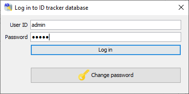
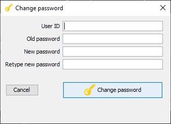
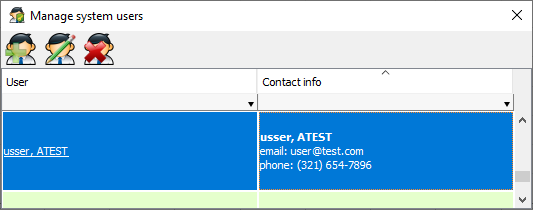
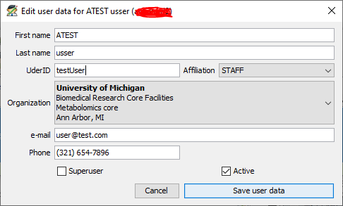
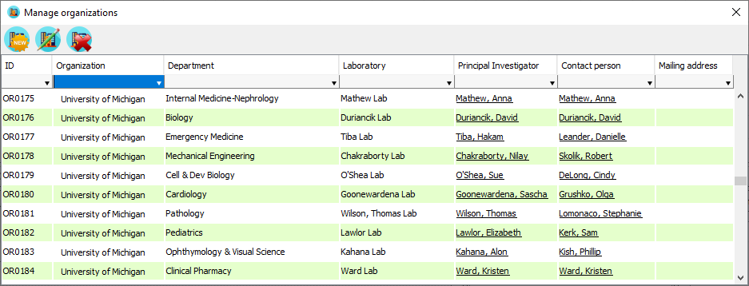
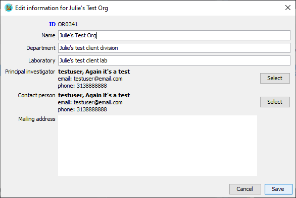
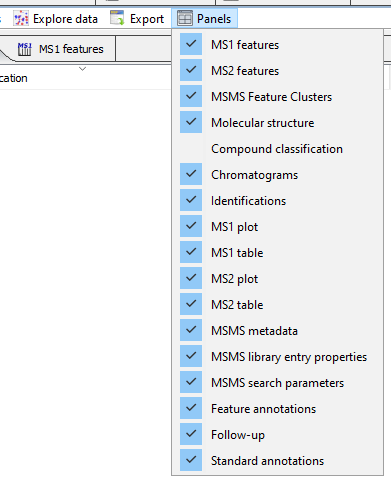
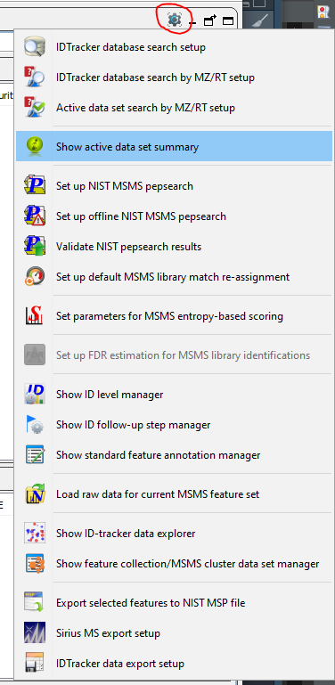
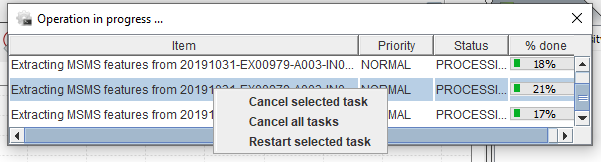

MetIDTracker is intended to be used as a tool for collaborative annotation of LC-MS/MSMS data. It is developed to improve the identification confidence in untargeted metabolomics experiments but may also be used to annotate other kinds of MS/MSMS data.

The system includes two components - the software with graphic user interface and the database. The database serves as a repository for reference data (compound database, MSMS libraries, etc.), experimental results (MS and MSMS spectra), and metadata (sample description, experimental conditions, instrument methods, etc.). Multiple users may access the same database and collaborate on the annotation of spectra.

It is highly recommended to run the software on a computer with at least 16GB RAM and to use a large high-resolution monitor (24" or more).

## Staring the program

To start MetIDTracker double-click StartMetIDTracker.bat file inside the MetIDTracker... folder. Software distribution includes its own version of Java runtime, so it doesn't matter if you have Java installed on your computer or not. By default, maximum RAM allocation for the program is set to 8GB. If your computer has RAM smaller than 12GB you may want to reduce memory allocation to MetIDTracker by editing HEAP_SIZE variable in the StartMetIDTracker.bat file before starting the program. The software was not tested with memory allocation of less than 4GB, however.

### Establishing connection between MetIDTracker and database

During program startup it will try to establish connection with the database using the settings from preferences. If this fails (e.g. during the first time you run the program, when database location and credentials were not provided yet), Database connection setup dialog is displayed ([Fig. 1](#db_conn_setup_dialog)).

{#db_conn_setup_dialog}

Edit host name, port, user, and password fields to match the parameters of your database configuration (SID/database and schema are determined by the database dump you've used at the previous steps and should not be changed). Click "Test connection" ([Fig. 2](#db_connection_test_dialog)) button to verify that database connection can be established using the parameters in the form. Click "Continue program startup" to save the connection parameters and launch the program.

{#db_connection_test_dialog}

Database connection parameters are stored in program preferences and unless the database can not be accessed (because it is down or there are network issues) or access credentials are changed, the connection will be established automatically, and Database connection setup dialog will not be shown.

While the program is starting up it will display the splash screen with the program version and build date ([Fig. 3](#startup_splash)).

{#startup_splash}

Current startup operation is displayed in blue at the bottom of the splash screen "Initializing user interface" stage may take some time (half a minute or more, depending on the available CPU resources and RAM).

### Logging into the database

MetIDTracker is a collaborative environment, and each user must provide his/her personal credentials to access and annotate the data. In the fresh installation there is a single user in the database with username "admin" and password "admin" (no quotations). Admin user may create other users with administrative or regular access, and it is recommended to change the admin password during the first program run.

At every program startup the login dialog is presented ([Fig. 4](#login_dialog)). You must be logged in in to use the software.

{#login_dialog}

Users may change their passwords. To do that, click "Change password" button on the login dialog, fill all the information in the "Change password" dialog ([Fig. 5](#change_password_dialog)) and click "Change password" button to confirm the change. Enter new password in the login dialog and click "Log in".

{#change_password_dialog}

Once you log in, the software will fetch the necessary data from the database (progress dialog will be displayed during that time). Your name and user icon will show as the first item of the "Database access" menu. If you log in as a user with administrative privileges, {height="24px" width="24px"} icon is replaced by {height="24px" width="24px"} (superuser), and "Show user manager" and "Show organization manager" items on the "Database access" menu are activated.

## Managing system users

If you log in as a user with administrative privileges, you will be able to access the User Manager ([Fig. 6](#user_manager_dialog)) through the "Database access" menu. Use icons on the panel toolbar to create, edit or delete the users. "Create User" and "Edit User" dialogs ([Fig. 7](#user_editor_dialog)) are identical, except "Edit User" dialog is pre-populated with the data for user selected in the User Manager. All fields must be populated with data. Every user has to be associate with organization (see the section below).

{#user_manager_dialog}

{#user_editor_dialog}

## Managing organizations

MetIDTracker is developed as a part of a larger software package adapted to the needs of the service lab, so the underlying database requires some additional structured information about the users. Organization Manager ([Fig. 8](#organization_manager_dialog)), available for users with administrative access, allows users to add or edit this information. You may open Organization Manager through the "Database access" menu.Use icons on the panel toolbar to create, edit or delete the organizations.

{#organization_manager_dialog}

"Add New Organization" and "Edit Organization" dialogs ([Fig. 9](#organization_editor_dialog)) are identical, except the "Edit Organization" dialog is pre-populated with the data for organization selected in the Organization Manager. All fields must be populated with data.

{#organization_editor_dialog}

## General notes about Graphical User Interface

### Rearranging panels

The user interface is based on DockingFrames library (www.docking-frames.org). It allows for flexible customization of the working area based on user preferences, preserving the layout between the sessions, and using more than one computer monitor for data analysis.

{#df_panel_controls}

Panel controls used in the new GUI are shown on [Fig. 10](#df_panel_controls). The horizontal bar (1) allows to minimize any panel to a small bar with icon, panel name and "restore" button (4). The corner button (2) allows to toggle the panel between its current size maximized within its parent panel. The detach/attach button (3) is present only on major panels ("MetIDTracker workbench", "MetIDTracker LIMS", "Raw data examiner", "Databases"). It allows the user to use the whole panel as a separate program window that may be moved to the second monitor.

All major panels may be rearranged inside the main program window and all smaller panels inside each of the major panels may also be rearranged according to user preferences. Moving the panel is achieved by clicking on its title tab (5) and dragging it to the desired location. Legitimate locations are highlighted by the blue frame and panel will snap to the new position when you release the mouse button ([Fig. 11](#df_rearrange_panels)).

{#df_rearrange_panels}

Layout of all program windows is preserved between sessions (program will re-open with the layout it when last closed). User may show/hide major program panels using "Panels" menu ([Fig2.12](#global_panels_menu)).

{#global_panels_menu}

All top-level panels include the menu bar with the last menu "Panels" which allows to select which sub-panels of the panel are visible and which are hidden ([Fig. 13](#sub_panels_menu)). They also have an additional icon next to panel controls to call the popup menu for all the commands associated with the panel ([Fig. 14](#panel_commands_menu)).

{#sub_panels_menu}

{#panel_commands_menu}

### Progress dialog

The progress dialog serves several purposes: it allows the user to monitor the execution of long tasks (database search, library search, etc.), it prevents the user from interacting with the program when the tasks that require heavy computations are running, and it allows the user to interrupt the long running tasks if necessary using commands from the context menu ([Fig. 15](#progress_dialog)). Maximal allowed number of concurrent running tasks is defined in the general preferences.

{#progress_dialog}

### Table layout manager

Some of the ID tracker tables contain a large number of columns which makes it difficult to see the necessary data and in different workflows the most suitable subset of columns, relative column order and line sorting order may be different. This manual describes how to customize these parameters.

To call table customization dialog right-click on the table header and select "Show table preferences" near the bottom of the context popup menu ([Fig. 16](#thPopupMenu)).

{#thPopupMenu}

The table customization dialog has two parts ([Fig. 17](#customizeTableDialog)). The upper part contains all the columns in the current order. All hidden columns are listed at the end. To enable or disable the column check/un-check the corresponding box in the "Visible" column.

{#customizeTableDialog}

It is now possible to sort the tables by multiple columns (Excel-like). To add the column to the sorter select it in the upper list, right-click and choose "Add column to sorter" from the context menu. The selected column will appear at the end of the sorter list below with ascending sort direction by default. You may change the direction of the sorting by selecting the necessary value in the "Sort order" column ([Fig. 18](#changing_sort_order)).

{#changing_sort_order}

To change sorting priority, select the sorter in the list, right-click and select "Increase sort priority to move sorter up, or "Decrease ..." to move it down. Select "Remove column from sorter" to stop sorting by the values in this column ([Fig. 19](#changing_sort_priority)).

{#changing_sort_priority}

Click "Apply" to apply the changes to the table. The changes will be saved, and the new layout will be used the next time you start the software. It also applies to the order of the columns. To reorder columns click and drag the column header to the new position (this operation is disabled on some tables, so the column order remains constant).
