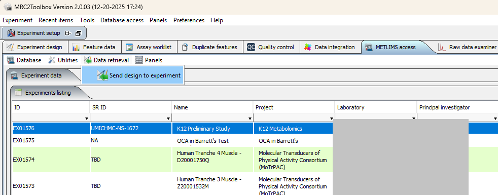
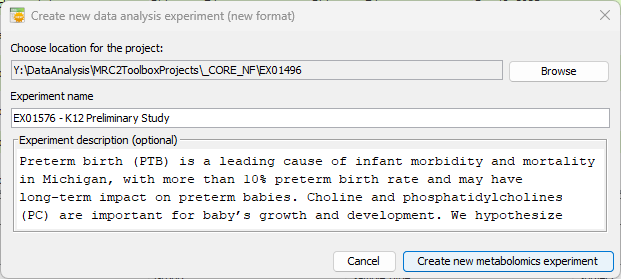
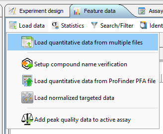
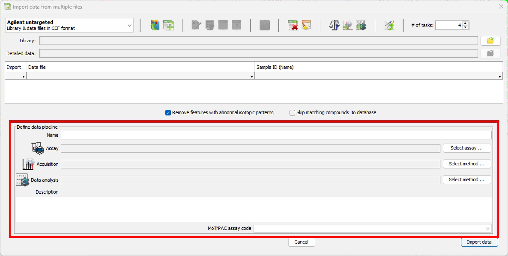
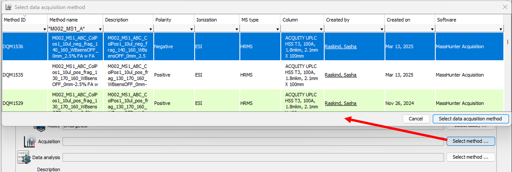
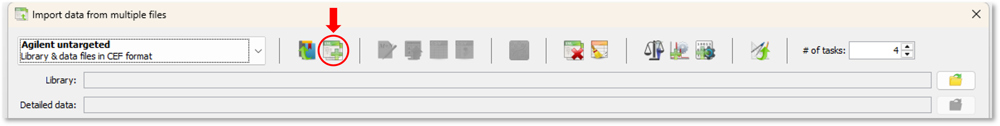
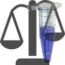
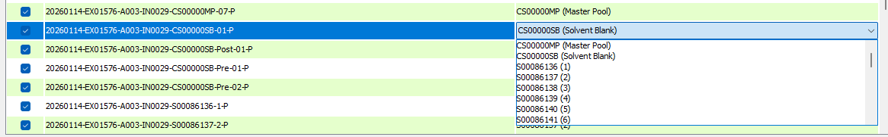
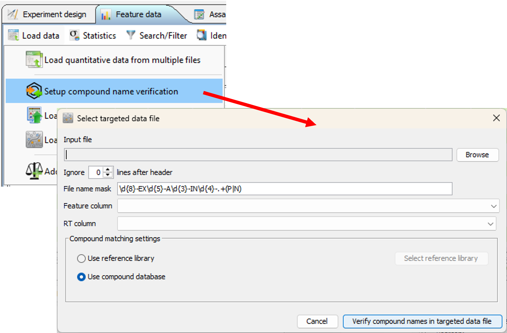
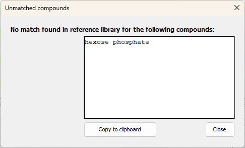

This tutorial describes the process of creating the metabolomics experiment based on experiment metadata stored in LIMS and various targeted and untargeted analysis results.

## Create new experiment from LIMS

Switch to "METLIMS access" panel, select the experiment in "Experiment listing" table and choose "Send design to experiment" from the panel's "Data retrieval" menu ([Fig. 1](#selectExperiment)).

{#selectExperiment}

"Create new data analysis experiment" dialog will appear ([Fig. 2](#saveNewProject)) that allows to choose the name of the new project (defaults to LIMS experiment name) and it's location on the disk (defaults to last used)

{#saveNewProject}

Switch to "Experiment design" panel, select "Edit reference samples" from panel's "Samples" menu and add the necessary control samples ([Fig. 3](#addControlSamples))

{#addControlSamples}

## Add data for specific assay / mode

Switch to "Feature data" panel and use panel's "Load data" menu to initiate the data load ([Fig. 4](#dataLoadMenu)).

{#dataLoadMenu}

### Define data pipeline

"Data pipeline" is a combination of data acquisition and data analysis method. Data pipeline name must be unique within the project, so must be the combination of data acquisition and data analysis methods. Different data analysis methods applied to the same raw data (same acquisition method) may be combined within a project as separate data pipelines. Data pipeline definition process is common for any type of input data. Data pipeline definition panel is located at the bottom of the data upload dialog ([Fig. 5](#dataPipelineDefinition)).

{#dataPipelineDefinition}

All fields except description are obligatory. Assay ([Fig. 6](#selectAssay)), data acquisition method ([Fig. 7](#selectAcquisitionMethod)), data analysis method ([Fig. 8](#selectDataAnalysisMethod)) and MoTrPAC assay code are selected from the database.

{#selectAssay}

Data in methods and assay tables can be filtered using search fields in each column header. Acquisition methods are stored within each Agilent .D file, so it's possible to copy method name from there and paste in the "Method name" column search field to select the correct method.

If acquisition method is not found in the table, it must be added to the database [added to the database](trackerLims.html#Data_acquisition_method_manager) first. Acquisition method editor may be called directly from the data load dialog using "Add data acquisition method" button ({width="32" height="32"}) on the toolbar.

{#selectAcquisitionMethod}

If data analysis method is not found in the table, it must be added to the database [added to the database](trackerLims.html#Data_extraction_method_manager) first. Data analysis method editor may be called directly from the data load dialog using "Add data extraction method" button ({width="32" height="32"}) on the toolbar.

{#selectDataAnalysisMethod}

### Add untargeted analysis data

-   Select "Load quantitative data from multiple files" from the "Load data" menu of the "Feature data" panel to display the data load dialog ([Fig. 9](#loadUntargetedDialog)).

{#loadUntargetedDialog}

-   [Define the data pipeline](#Define_data_pipeline).
-   Select CEF library used for the recursive search ([Fig. 10](#selectCefLibrary))

{#selectCefLibrary}

-   Select the results of the recursive search in CEF format ([Fig. 11](#selectRecursiveResults))

{#selectRecursiveResults}

#### Matching the data files to the samples

If data file names were generated by LIMS selected CEF data files will be automatically matched to the samples based on LIMS sample ID. This will work for both regular samples and controls. If some controls were not added to experiment design before importing the data they can be added at the stage of data import using "Edit reference samples" button ({width="32" height="32"}) on the dialog toolbar. Unmatched data files must be then manually matched to the samples. This may be done file by file ([Fig. 12](#assignSampleToSingleFile)) or for multiple files when they all correspond to the same sample, e.g. experiment pool ([Fig. 13](#assignSampleToSingleFile))

{#assignSampleToMultipleFiles}

Click "Import data" button a the bottom right corner of the dialog to start data import.

Per feature statistics is calculated during data import. Features not detected in regular samples and pools are automatically excluded from the import.

### Add targeted analysis data

#### From plain text file

Targeted analysis data may be imported from plain text files (TAB- or comma-separated). The files should have one line per compound and one column per data file. Column containing compound name is obligatory and is selected by the user from the list of all columns in the data file. Retention time column is optional and also may be selected by the user if present in the data.

Steps to import the data:

-   Verify compound name data ([Fig. 14](#compoundNameVerification)). This is an optional step since it will be performed during the data load in any case, but it may save some time down the road. Two kinds of reference data may be used to link compound name in the data file to the standardized compound information - compound database (REFMET) or compound library previously uploaded to the database.

{#compoundNameVerification}

After the input file is selected "Feature column" and "RT column" dropdown menus are populated with column names. Check that correct columns are selected. If RT column is absent in the data check that the first (blank) option is selected in the "RT column" dropdown. If input data come from the normalization routine they may include additional lines between the header and compound data. Use "Ignore \# lines after header" spinner to specify how many lines must be excluded. Click "Verify compound names in targeted data file".

If any of the compound names in the analysis results file can not be matched to REFMET (directly or as synonyms), these unmatched names will be listed in the information dialog ([Fig. 15](#compoundMatchNotFound)). Data containing unmatched compounds can not be imported in the project.

{#compoundMatchNotFound}

-   Select "Load targeted data from plain text" from the "Load data" menu of the "Feature data" panel to display the data load dialog.
-   [Define the data pipeline](#Define_data_pipeline).
-   Select the text file containing targeted analysis data ([Fig. 16](#selectTargetedDataFile))

{#selectTargetedDataFile}

Select feature name and RT columns and the number of lines to skip as described above and click "Verify compound names in targeted data file". If no unmatched compounds are found button text will change to "Parse targeted data file". Click the button to move to the next step.

-   [Match data files to samples](#Matching_the_data_files_to_the_samples) if necessary and click "Import data" tp complete the process.

#### From simple ProFinder export file

Under development

#### From combination of ProFinder export files in different formats

Under development

### Add instrument worklist data

This option is currently supported for Agilent platform. Instrument worklist data include injection time and volume, acquisition method and other information for each raw data file. Having it in the project allows better data visualization and quality control.

Worklist data may be added after the quantitative data (targeted or untargeted) are imported. Switch to "Assay worklist" panel and select "Scan directory for sample information" from "Load" menu ([Fig. 17](#scanDirForWorklistMenu)). Navigate to the directory containing corresponding raw data files and click "Select folder" to extract worklist information from .D files. If not all the data files present in the imported analysis results can be found in the specified directory, unmatched files would be listed in the warning dialog. Use "Add sample information from directory" command from "Load" menu to scan additional directories for missing worklist data.

{#scanDirForWorklistMenu}
