# Introduction

IDTracker allows to create and store various types of data collections in order to simplify and streamline data analysis and interpretation. The following types of data collections are supported at the moment:

-   MSMS feature collections

-   MSMS feature cluster data sets

    -   Based on MZ/RT search list
    -   Based on spectra similarity and optional retention time window
    -   Based on Binner annotations list

-   Feature lookup lists (MZ/RT search lists)

-   Binner annotation data sets

Feature colections and cluster data sets may be stored in the database, if underlying experimental data are already uploaded, or as parts of the offline raw data analysis experiments.

# Managing data collections

Data collection manager ([Fig. 1](#dataCollectionsManager)) allows to create, retrieve, edit, and delete various types of data collections. It hosts separate tabs for different data collection types (see sections below). The {height="24px" width="24px"} icon on the dialog toolbar is to force synchronization of all the data collection listings with the database.

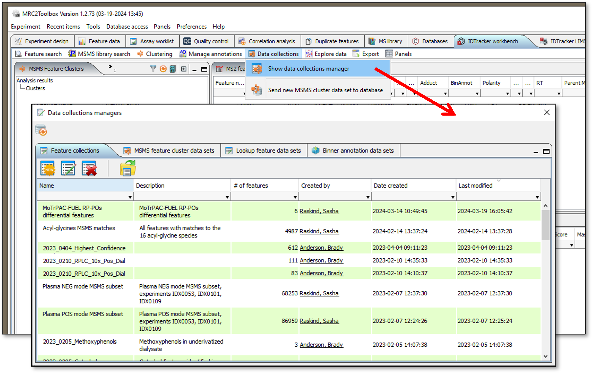{#dataCollectionsManager}

<br/>

## Feature collection manager

Feature collection manager ([Fig. 1](#dataCollectionsManager), active tab) contains the list of existing MSMS feature collections with some associated metadata (optional description, \# of features in collection, owner, date created). To retrieve the features for any of these collections and load them into the workbench you may either double-click on it, or select it and click "Load selected feature collection for analysis" button (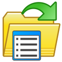{height="24px" width="24px"}) on the toolbar.

When working with offline raw data analysis experiments only feature collections for this experiment are listed in the table. "Active experiment complete feature set" is the default collection that includes all the features in the offline experiment and can not be edited.

### Create new feature collection

Feature collection manager allows to create new empty collection or new collection from the list of MSMS feature IDs. Click "New feature collection" button (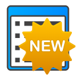{height="24px" width="24px"}) to call the feature collection editor dialog ([Fig. 2](#newFeatureCollection)). Specify collection name and description (optional). Name would be checked against the existing collections to avoid confusion from duplicate collection names. If you have a list of MSMS feature IDs that you want to include in the new collection you may attach it using "Browse" button. The list must be a plain text file with single MSMS feature ID per line (MSN_ prefix followed by 12 numbers):

```
MSMS_FEATURE_ID
MSN_000001281730
MSN_000003604324
MSN_000001282245
MSN_000001282583
......

```

Feature ID list will be verified against database, only existing feature will be included.
Check the "Load collection in the workbench" checkbox if you are creating a non-empty collection and would like to start working with it right away. Click "Create new feature collection..." button to complete the process.

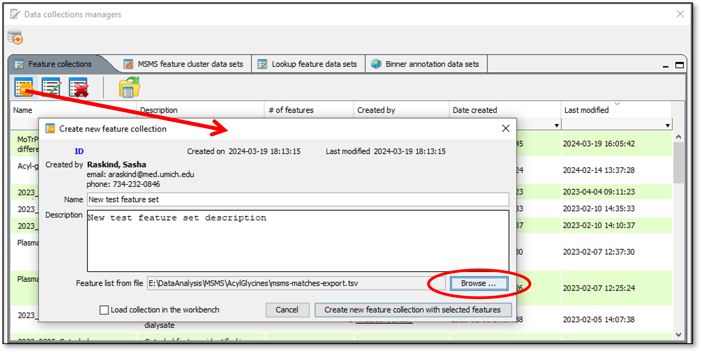{#newFeatureCollection}

<br/>

### Edit existing feature collection

You may edit name and description of existing collection, and add MSMS features to it from the text file the same way as when creating a new collection ([Fig. 3](#editFeatureCollection)). Feature ID list would be verified against the database and all the features already present in the collection will be excluded to avoid duplication. New name would be verified to make sure that a different feature collection with the same name is not already present in the database or offline project. 

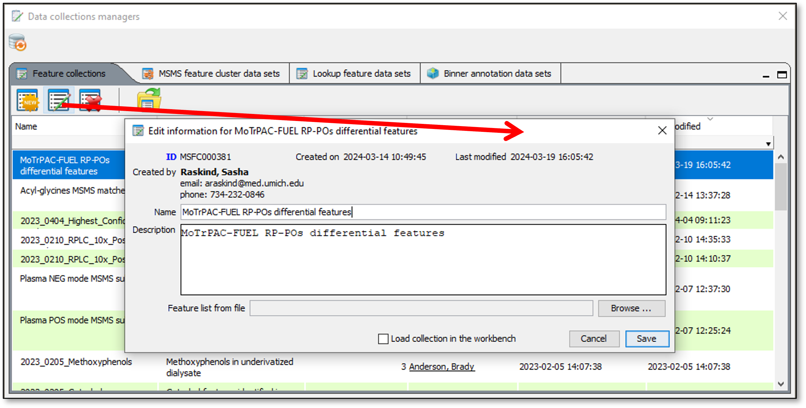{#editFeatureCollection}

<br/>

To delete the database-stored feature collection you must have administrative access to IDtracker.

## Feature cluster data set manager

Feature cluster is a relatively small group of MS or MSMS features satisfying the set of criteria. For example it is possible to use the list of M/Z - retention time value pairs to search a large data set of MSMS features. In many cases there would be more than one MSMS feature for which parent ion M/Z and retention time will match the same MZ/RT value pair from the search list within specified tolerance limits. These MSMS features with similar MZ/RT values will be combined in a cluster and all clusters produced as a result of such search procedure will form a feature cluster data set. There are other ways to create feature cluster data sets which will be covered in separate sections of the manual and tutorials. Feature cluster data sets may be stored in the database, if underlying experimental data are already uploaded, or as a part of the offline raw data analysis experiment. 

All feature cluster data sets currently stored in the database are listed in the table on the "MSMS feature cluster data sets" tab of the data collections manager ([Fig. 4](#msmsClusterDataSetManager)).

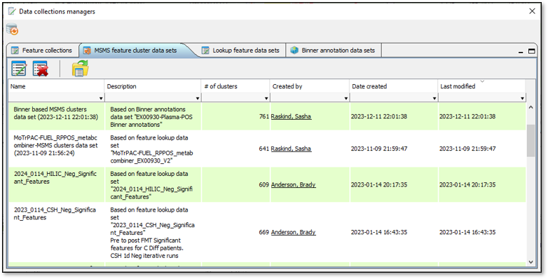{#msmsClusterDataSetManager}

<br/>

To load the feature cluster data set into the workbench you may either double-click on it in the table, or select it and click "Load selected MSMS cluster data set for analysis" button ({height="24px" width="24px"}) on the toolbar.

### Edit existing cluster data set

You may edit name and description of existing cluster data set ([Fig. 5](#editFeatureClusterCollection)). New name would be verified to make sure that a different feature  cluster data set with this name is not already present in the database or offline project.

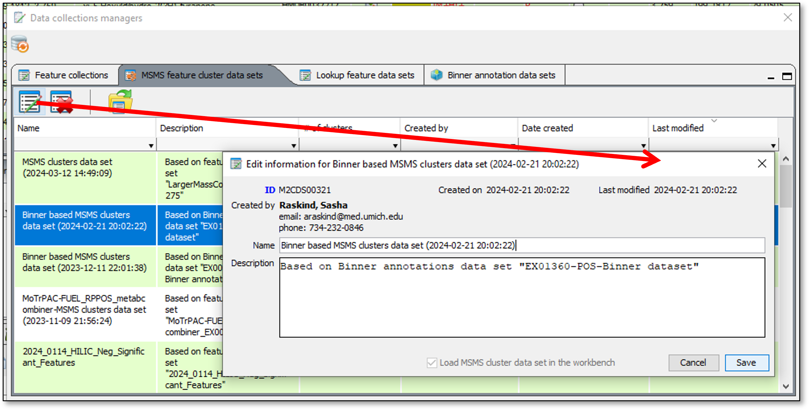{#editFeatureClusterCollection}

<br/>

To delete the database-stored feature cluster data set you must have administrative access to IDtracker.

## Feature lookup list manager

Analysis of untargeted metabolomics data often produces a number of unknown (unidentified) features of interest that are characterized only by monoisotopic M/Z and retention time. It is possible to use these lists of MZ-RT pairs to search the annotated MSMS data in IDTraker in order to help with the identification of unknowns. With database-centered workflow is is useful to store both the search results (in the form of feature cluster data set) and the list of features used for the search (feature lookup list). All currently available feature lookup lists are shown in the table on the "Feature lookup lists" tab of the data collection manager ([Fig. 6](#featureLookupDataSets)).

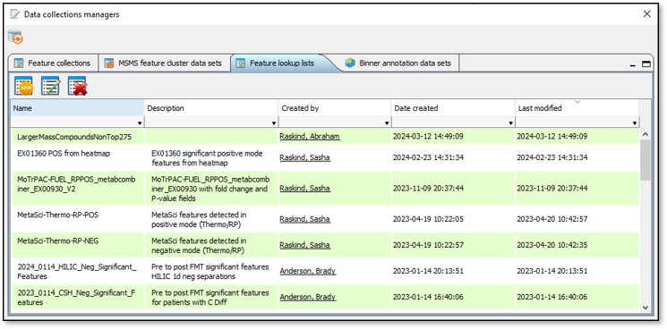{#featureLookupDataSets}

<br/>

### Create new feature lookup list

Click "Create new feature lookup list" button ({height="24px" width="24px"}) to call the feature lookup list editor dialog ([Fig. 7](#createNewFeatureLookupDataSet)). Specify list name and description (optional). Name would be checked against the existing lists to avoid confusion from duplicates.

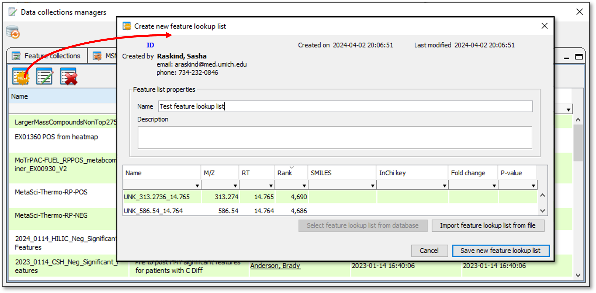{#createNewFeatureLookupDataSet}

<br/>

List of features may be imported from plain text file (TAB or comma delimited), or from CEF file. Text files must have a header line that contains MZ, RT, and Name columns. Rank, SMILES, InChiKey, P-value, and Fold change columns are optional. Rank, P-value, and Fold change columns must contain numbers and may be used to sort the search results by importance (higher rank -> more important feature, etc.). SMILES may be used to display the structure of the lookup features when known. InChiKey may be used to find the SMILES for the features in the internal compound database when SMILES are not provided in the input list.

### Edit existing feature lookup list

To edit name and description of the existing feature lookup list double click on the corresponding line in the Feature lookup list manager or select the list in the table and click ({height="24px" width="24px"}) icon on the toolbar to bring up the editor dialog ([Fig. 8](#ditFeatureLookupList)).

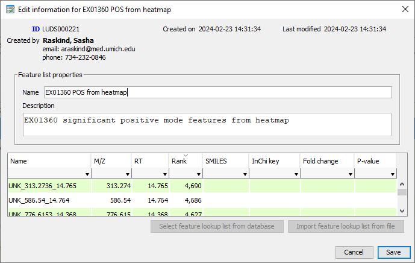{#editFeatureLookupList}

<br/>

To delete the database-stored feature lookup list you must have administrative access to IDtracker.

## Binner annotation data sets manager

Binner is an application that allows to find related MS features (isotopologues, adducts, and in-source fragments) using a set of MS1 data. Binner annotations may help to identify MSMS features by correctly defining the type of parent ion as opposed to the default [M+H]/[M-H]. Similarly to the lists of lookup features, Binner annotation data sets may be stored in the IDtracker database in order to provide reproducibility and ease of reuse. All currently available Binner annotation data sets are shown in the table on the "Binner annotation data sets" tab of the data collection manager ([Fig. 9](#binnerAnnotationDataSets)).

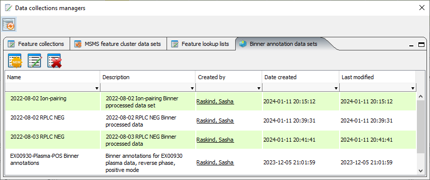{#binnerAnnotationDataSets}

<br/>

### Add new Binner annotation data set

Click "Create new Binner annotation data set" button ({height="24px" width="24px"}) to call the Binner annotation data set editor dialog ([Fig. 10](#createNewBinnerAnnotationsDataSet)). Specify data set name and description (optional). Name would be checked against the existing lists to avoid confusion from duplicates.
Depending on the settings Binner may stil contain some redundant features which will create problems when searching for MSMS features in IDTracker database. To remove this redundancy small M/Z and RT windows are used during the import to combine the data for redundant Binner features (molecular ions). Default values are 20 ppm for M/Z and 0.3 min for retention time. Click "Import Binner annotations from file" button and select Binner output Excel file. Binner output files are often quite large and import may take some time. Once import is completed the parsed data are displayed in the table at the bottom of the dialog.

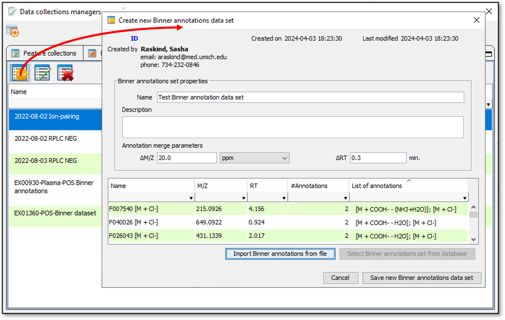{#createNewBinnerAnnotationsDataSet}

<br/>

### Edit existing Binner annotation data set

To edit name and description of the existing Binner annotation data set double click on the corresponding line in the Binner annotation data set manager or select the data set in the table and click ({height="24px" width="24px"}) icon on the toolbar to bring up the editor dialog ([Fig. 11](#editBinnerAnnotationsDataSet)).

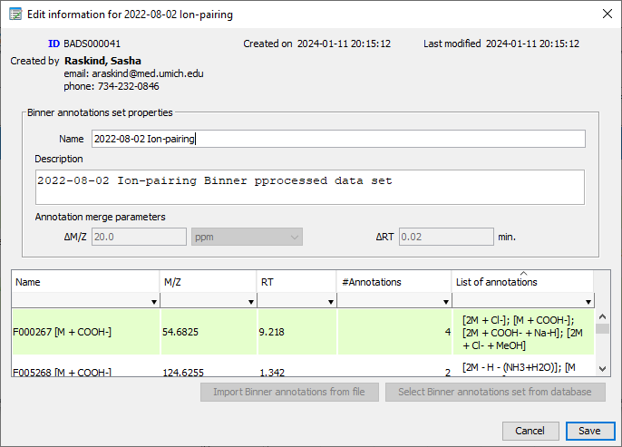{#editBinnerAnnotationsDataSet}

<br/>

To delete the database-stored Binner annotation data set you must have administrative access to IDtracker.

# Using feature collections

## Adding features to collection

You may add one or more MSMS features to any of the existing collections or create a new collections and add selected features to it in a single operation. A few different ways to do it are described in the sections below.

### Adding from MSMS feature table

Select one or more features in the MSMS feature table. Press and hold "Shift" button to make the continuous selection of rows. Press and hold "Control" button to select non-adjacent rows. click on any row and then press "Control-A" to select all visible rows in the table. When the rows of interest are selected, right-click on the table to display the context popup menu ([Fig. 12](#addFeaturesToCollectionFromTable)). The following options are available:

-  Create new collection from selected features
-  Add selected features to recent collection
-  Add selected features to existing collection
-  Remove selected features from the currently active collection

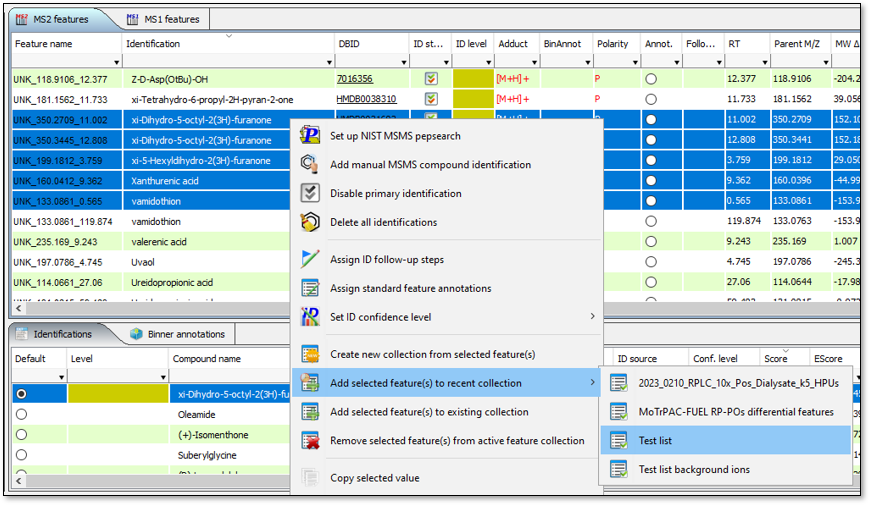{#addFeaturesToCollectionFromTable}

<br/>

If you choose "Create new collection from selected features", the feature collection editor dialog ([Fig. 13](#createNewFeatureCollectionFromSelected)) will be shown. After you specify the new collection name, optional description and click "Create new feature collection with selected features", the new collection will be saved to the IDtracker database. If you are working with the offline project new collection will be added to this project, but you must save the project to be able to use it in the later sessions (the "Save project" prompt is always displayed when closing the project or closing the software with active project).

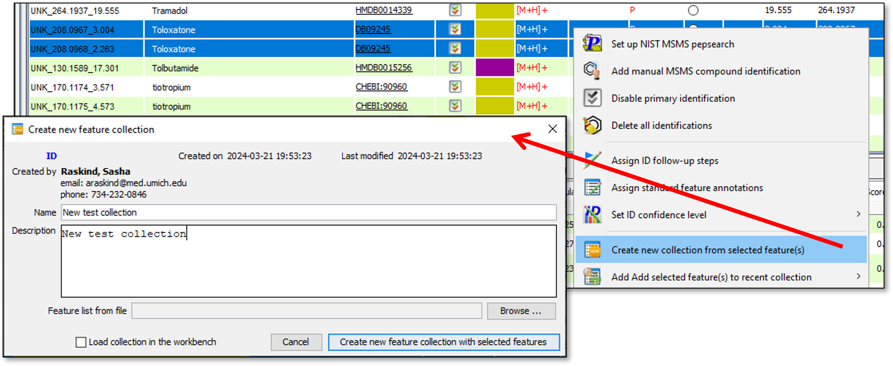{#createNewFeatureCollectionFromSelected}

<br/>

If you choose "Add selected features to recent collection" you can add the features to any of the recently opened collections listed in the sub-menu ([Fig. 12](#addFeaturesToCollectionFromTable)). This list is updated every time you load the existing feature collection for analysis or create new the collection. Its maximum size is now set to 15 items. In the menu they are sorted in alphabetical order, but internally stored in the order they were added. After maximum size is reached the oldest item in the list will be removed to free the space for the new one.

If the collection to which you want to add the features already exists but is not in the "Recent ..." list you must use the "Add selected features to existing collection" option. The list of all available collections will be shown ([Fig. 14](#addFeaturesToExistingCollection)), select the collection of interest and click "Add features to selected collection" button to complete the operation.

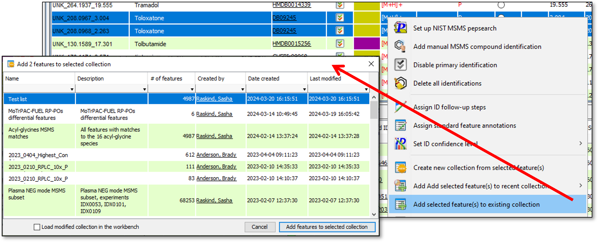{#addFeaturesToExistingCollection}

<br/>

To remove the selected features from the currently active collection you must be the owner of this collection (as listed in the "Created by" column of the feature collection manager).

### Adding from MZ/RT plot

Sometimes it may be useful to explore the data set using MZ/RT plot. To show the plot window go to "Explore data" menu in the IDTracker workbench menu bar and select "Show MetIDTracker data explorer" ([Fig. 15](#showDataExplorerPlot)). When you call it the first time, the plot will be empty and you must click the "Refresh plot" button to populate it.

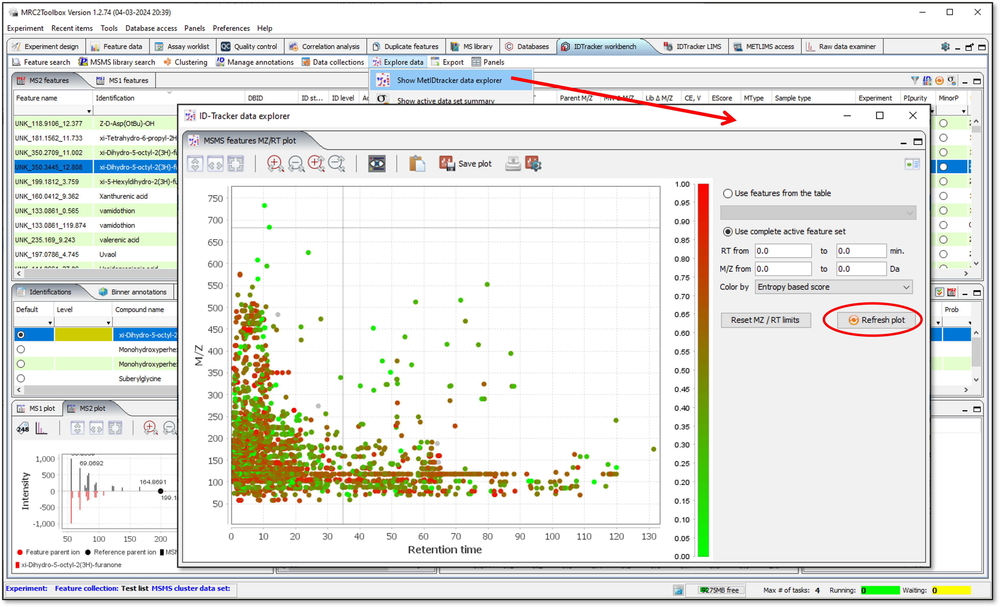{#showDataExplorerPlot}

<br/>

Different plot controls will be covered elsewhere. This section of the tutorial will only explain how to select a group of features and add them to the feature collection. 

Zoom to the region of interest on the plot, press and hold the "Shift" button, then press the left mouse button and drag the mouse until the features of interest are within the highlighted rectangle. Right-click on the highlight to display the context popup menu ([Fig. 16](#addFeaturesToCollectionFromMZRTPlot)). Options for adding the features to collections are the same as described in the [Adding from MSMS feature table] section above.

To clear the selection press "Shift" and click anywhere within the plot area. 

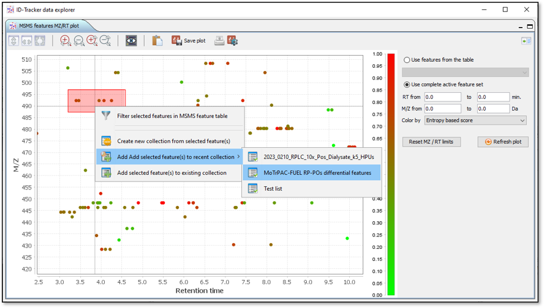{#addFeaturesToCollectionFromMZRTPlot}

<br/>

### Adding from M/Z frequency analysis window

Background ions may constitute a significant portion of all acquired MSMS data. They are usually present over large regions of chromatogram and the same MZ may be encountered multiple times. One way to identify bakcground ions is to find these large groups of similar features binning them based on narrow M/Z window. To set up this analysis load the data set of interest into IDTracker and select "Set up M/Z frequency analysis" from the "Explore data" menu of the workbench panel ([Fig. 17](#mzFrequencyAnalysisSetup)). Adjust M/Z binning frequency if necessary and click "Run M/Z frequency analysis" to start the calculations.

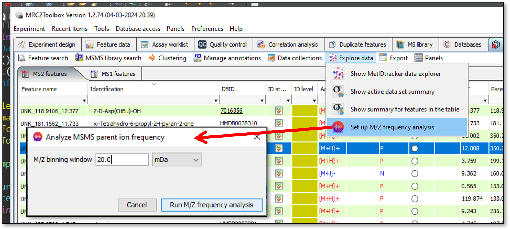{#mzFrequencyAnalysisSetup}

<br/>

Once the analysis is complete the results are displayed in the new dialog in table form. Select one or more compound groups in the table and use the toolbar or context menu command to apply various annotations to multiple features. Options for adding the features to collections are the same as described in the [Adding from MSMS feature table] section above. 

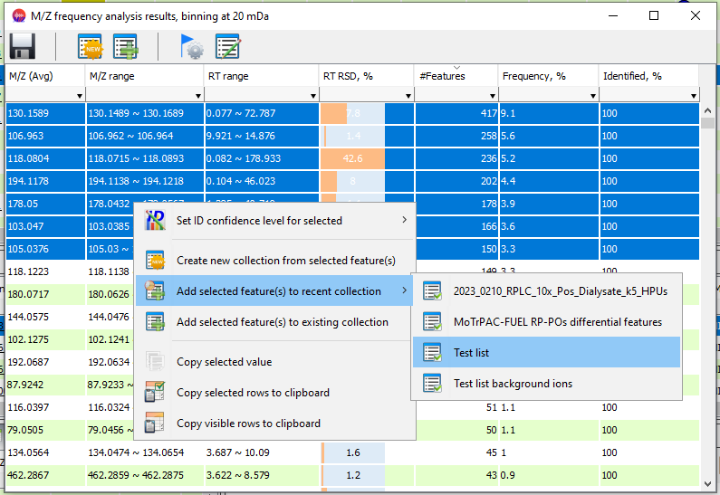{#mzFrequencyAnalysisResults}


