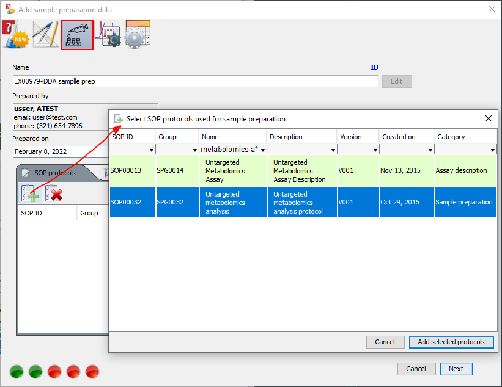

# Creating database-stored experiment

MetIDTracker is designed as collaborative tool and in order to allow multiple users to provide input for feature identification and annotation data must be stored in the central repository. Offline experiment including analysis results may be uploaded to the repository and converted to online experiment if the necessary metadata are provided by the user. This tutorial will guide you through the process of offline-to-online conversion for MSMS analysis experiment.

## Adding experiment metadata

Open the existing offline experiment. Switch to the raw data examiner panel and select "Add experiment metadata" from the "IDtracker integration" menu to show the metadata wizard ([Fig. 1](#callingMetadataWizard)).

{#callingMetadataWizard}

The wizard will guide you through the process of adding the metadata necessary for uploading the offline experiment to the repository and creating the online experiment.

### Defining basic experiment details

The first step ([Fig. 2](#metadataWizardStep1)) is to define basic experiment details. Most of the data will be carried over from the offline experiment definition, but may also be edited at this point.You must select the parent project for the experiment from the "Project" dropdown.

{#metadataWizardStep1}

Click "Next" to save the information and go to "Experiment design" step of the wizard.

### Defining experiment design

In the database MS and MSMS data must be linked to biological samples. MetIDTracker main task is in-depth characterization of the samples which implies analysis of the data obtained from the same biological material in multiple ways (e.g. exhaustive MSMS through iDDA in positive and negative mode). The term "Stock sample" denotes the source of material for multiple assays. Usually it is a pooled sample created combining aliquots of individual biological samples (for liquid samples) or extracts (for cell and tissue samples). Click "Add sample" button ({height="24px" width="24px"}) on the toolbar to show the corresponding dialog, then click "Select stock sample" button, select sample in the table and double-click it or use "Select stock sample" button to add it to sample definition ([Fig. 3](#metadataWizardStep2)). By default the sample will be named "Aliquot of ... (stock sample name)". You may change the name and add some notes at this point. Click "Add sample button" to complete the process. Sample ID at this stage is just a placeholder, actual sample ID will be assigned during the database upload. If you have the raw data coming from blanks or other control samples, these sample types also must be defined in the database as stock samples and added at this stage.

{#metadataWizardStep2}

If stock sample you intend to use is not added to the database, you must do it prior to adding the samples to your experiment. You may do it directly from the wizard. Click "Add reference sample dialog" button on the toolbar ({height="24px" width="24px"}), specify sample name and description in the "Add new stock sample" dialog ([Fig. 4](#stockSampleDialog)), select sample type ([Fig. 5](#sampleTypeDialog)) and species ([Fig. 6](#speciesSelectionDialog)). Sample type and species selection dialogs are pre-populated with recently used terms. If the necessary term is not listed in the table yet, use "Search" functions of the respective dialogs. Sample types are based on PubMed MESH terms, species list is based on NCBI taxonomy.

{#stockSampleDialog}

{#sampleTypeDialog}

{#speciesSelectionDialog}

Click "Next" to verify and save the information and go to "Sample preparation" step of the wizard.

### Defining sample preparation

Sample preparation may vary for the same stock sample depending on the type of chromatography or targed subset of compounds (e.g. different extraction methods for hydrophylic and hydrophobic compounds). At this step you must specify prep name, date ([Fig. 7](#metadataWizardStep3-date)), person in charge ([Fig. 8](#metadataWizardStep3)), and link pre-defined SOPs for sample preparation ([Fig. 9](#metadataWizardStep3-sop)). You may also link optional documents with notes for this specific sample preparation.

{#metadataWizardStep3-date}

{#metadataWizardStep3}

{#metadataWizardStep3-sop}

Click "Next" to verify and save the information and go to "Data acquisition methods" step of the wizard.

### Defining data acquisition methods

MS and MSMS data must be linked to the specific instrument data acquisition methods in the database. At this step you may either select existing method(s) or add new ones. There are a few options to select or add the methods. If raw data are coming from Agilent platform you may simply scan the directory containing original .D files for information, since every Agilent .D folder contains the complete data acquisition method (this scan is one level deep, so if you have nested directories with raw data acquired using different methods, you must scan every directory containing actual .D files to find all method files). Use "Scan directory for sample information" button ({height="24px" width="24px"}) on the "Data acquisition methods" panel toolbar to scan .D files for methods.

For other platforms, if the methods are already in the database you may use the ""Show data acquisition method selector" button ({height="24px" width="24px"}) to display the table of existing methods and select from it ([Fig. 10](#metadataWizardStep4-existing)).

{#metadataWizardStep4-existing}

If specific acquisition method was not yet uploaded to the database, use the "Add acquisition method dialog" button ({height="24px" width="24px"}) to call the corresponding dialog ([Fig. 11](#metadataWizardStep4-new)). Method name and description will be auto-populated when you select the method file, all the other fields are obligatory. Mobile phase and gradient panels are still under development and must be ignored.

{#metadataWizardStep4-new}

Click "Next" to verify and save the information and go to "Add instrument worklist" step of the wizard.

### Adding instrument worklist

This is the final stage of metadata definition where all previously added pieces of information are properly linked with sample run sequence. Using table contextual menu you must link every data file to the sample ([Fig. 12](#metadataWizardStep5-samples)) and acquisition method ([Fig. 13](#metadataWizardStep5-methods)), specify injection volume ([Fig. 14](#metadataWizardStep5-injvol)), and if necessary, injection timestamp. mzML files usually contain the correct timestamp and this field will be populated automatically. mzXML files, however do not carry this information over from the original vendor file, so it must be specified manually ([Fig. 15](#metadataWizardStep5-timestamp)). You may assign values to multiple files at once if you select more than one file before choosing the command from the contextual menu.

{#metadataWizardStep5-samples}

{#metadataWizardStep5-methods}

{#metadataWizardStep5-injvol}

{#metadataWizardStep5-timestamp}

Once all the necessary information is provided click "Save experiment metadata" button. The wizard will check if the metadata definition is complete and save the experiment to preserve the information you entered. At this point the experiment is ready for database upload. You may continue to perform data analysis in the offline mode and upload the experiment later.

## Uploading the experiment

Select "Set experiment database upload parameters" from "IDTracker integration" menu ([Fig. 16](#experimentDbUploadSetup)). At the moment there is only one parameter - "MS1 extraction window for database upload: +/-". It's purpose is to reduce the amount of data uploaded to the database by limiting uploaded MS1 scan portion to the region of interest around the parent ion in a way that is still sufficient to calculate precursor purity and determine whether monoisotopic peak was selected for fragmentation.

{#experimentDbUploadSetup}

Click "Send experiment data to database" to start the upload. It may take some time depending on the number of features detected and whether analysis data (library search results, etc.) are present. 
Once upload is complete the experiment is automatically saved to preserve all the offline data in sync with the database copy (this mainly includes identifiers assigned to various objects when they are saved to the database).
Once experiment is uploaded to the database all further analysis must be performed in online mode. Editing metadata and repeated uploads will be blocked to preserve data integrity of the central repository ([Fig. 17](#blockExistingExperimentUpload)).

{#blockExistingExperimentUpload}

## Retrieving experiment data from repository

There is a number of ways to retrieve the data from specific experiment for further analysis. 
