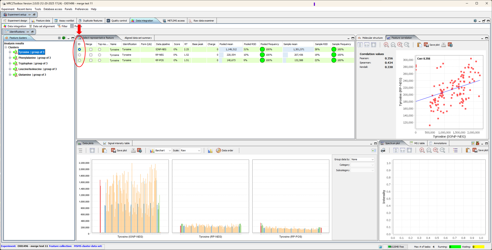

This tutorial describes the process of merging of the targeted analysis results obtained from the same set of samples using different LC-MS modes.

Creation of the project and import of the targeted data are described in a separate [tutorial](#createMetabolomicsExperiment.html)

## Setup data merge

-   Switch to "Data integration" panel and select "Data integration setup" from the "Data integration" panel menu ([Fig. 1](#mergeSetup)).

{#mergeSetup}

-   Specify the name for merged data set, select two or more data pipelines you want to merge

-   Specify which metrics to use to select the representative data for the compound when it is detected by more than one method.

    -   Minimal number of missing data points in samples (not including controls)
    -   Highes median peak area for samples (not including controls)

Click "Integrate data for named compounds" to create the merged data set. "Feature clusters" tree on the left side of the panel will be populated with merge results.

## Curate merged results

Some compounds are detected by more than one LC-MS method. The software will select the method providing the best data based on the user-specified criteria (minimal missingness or maximal area), but these assignments may be changed during manual curation. To simplify the curation process it is recommended to hide all compounds detected by a single method ([Fig. 2](#filterSingles))

{#filterSingles}

To select a different feature to be included in the final merged data set click the radio button in the corresponding line of the "Select representative feature" table ([Fig. 3](#dataSetMergeCuration))

{#dataSetMergeCuration}

## Export merged data set

Merged data set will include a single entry for each compound. To export the merged data set select "Export integrated data set" from the panel's "Data integration" menu and follow the prompts ([Fig. 4](#exportMergedDataSet))

{#exportMergedDataSet}

Data are exported as TAB-separated text file, sample names are used in the header. The file is saved to "exports" sub-directory of the project. To quickly locate the exported data select "Go to experiment folder" from the main window "Experiment" menu ([Fig. 5](#openProjectDirectory)) and then open the "exports" folder.

{#openProjectDirectory}
