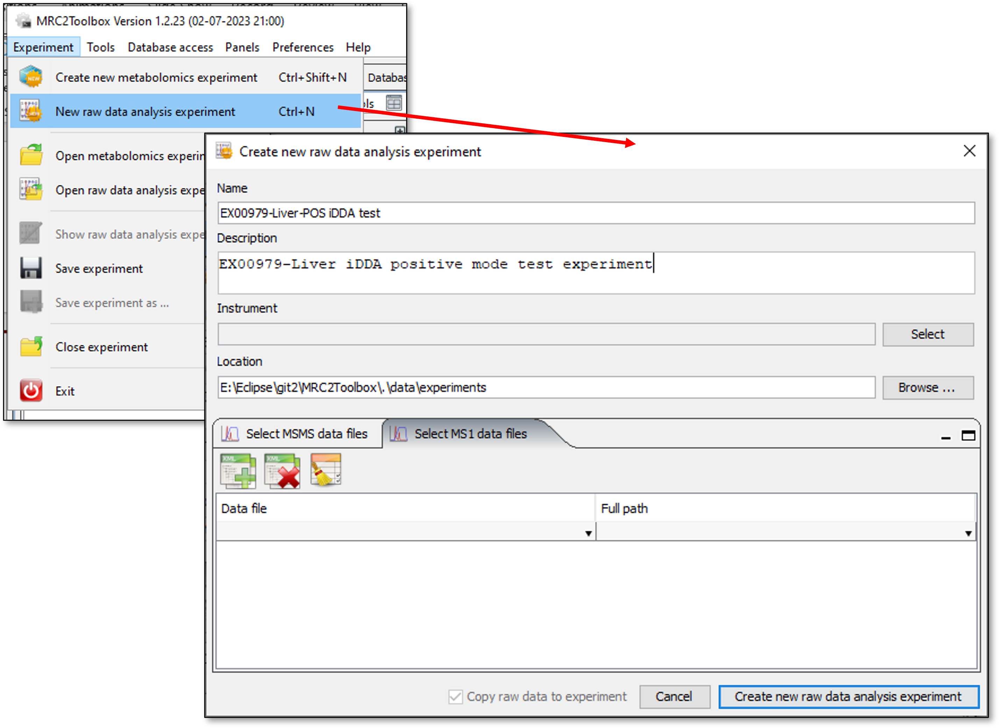
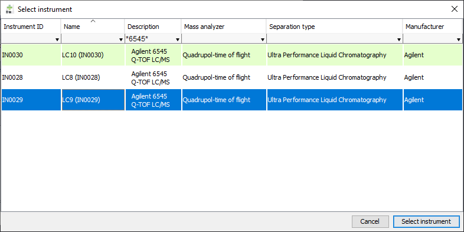
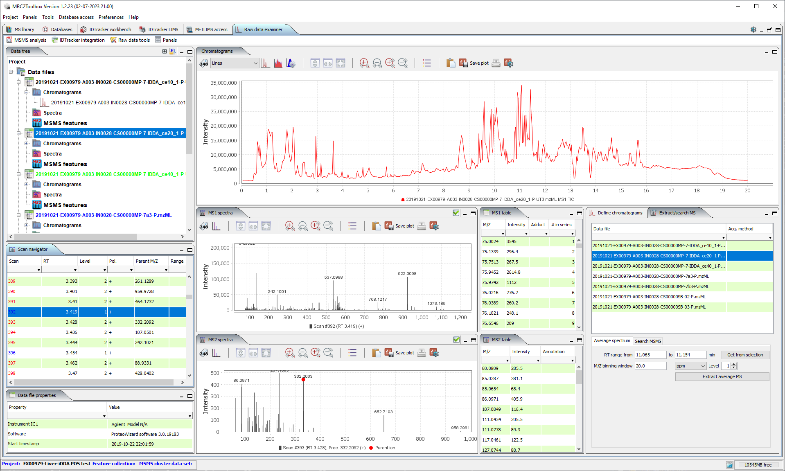
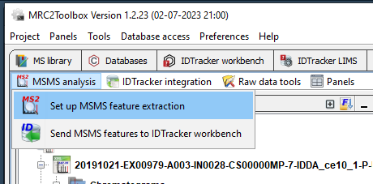
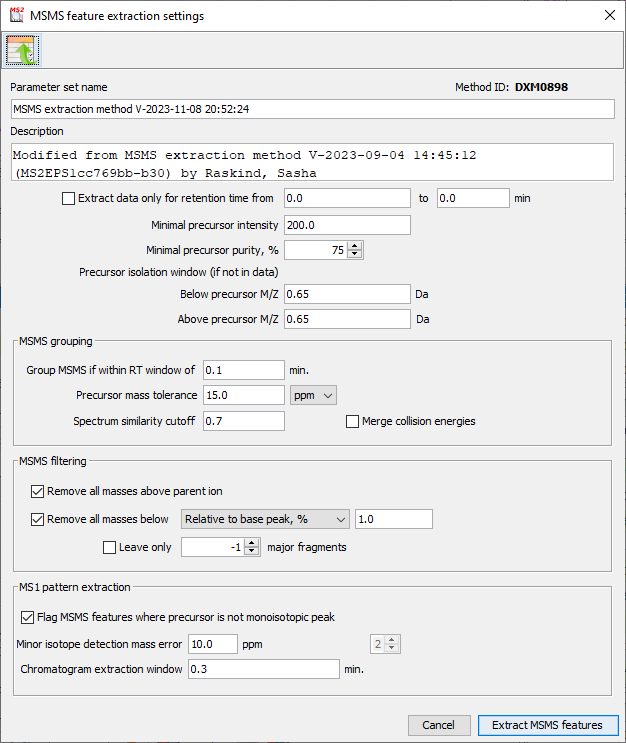
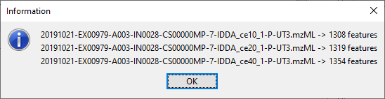
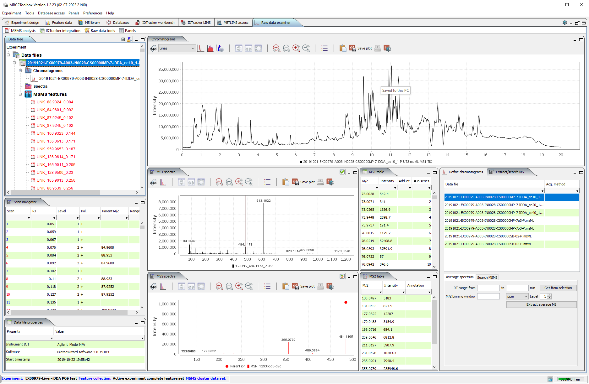
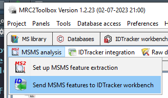
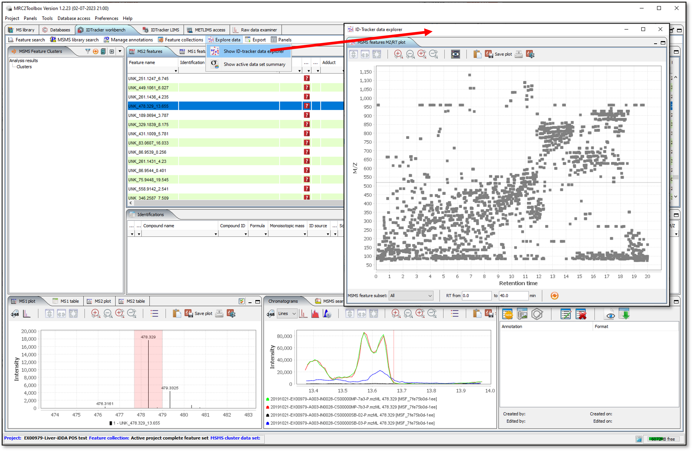

# Offline experiment

Offline experiment in MetIDTracker is a starting point of analysis of MSMS data when you are not relying on any third-party tools.It allows to extract MSMS features and corresponding chromatograms from raw data files and use all the tools for feature identification and annotation without uploading the results to the database. Once MSMS extraction and identification parameters are optimized, experiment may be uploaded in the database for collaborative data curation and analysis.

MetIDTracker supports working with mzML and mzXML file formats. Proprietary raw data formats from all major LC/MS equipment vendors may be converted to mzML or mzXML using msconvert routine from ProteoWizard package. MetIDTracker provides the graphical user interface to msconvert described in details in the [manual](#Manual.html#raw-data-conversion)

## Creating offline experiment

To create new offline experiment select "New raw data analysis experiment" from "Experiment" menu to display "Create new raw data analysis experiment" dialog ([Fig. 1](#createOfflineExperimentFig))

{#createOfflineExperimentFig}

Specifying name, location, instrument and MSMS files is obligatory, other fields are optional. To select LCMS instrument click "Select" button next to instrument field, choose instrument from the table ([Fig. 2](instrumentSelector)) and either double-click on it or click "Select instrument button" to complete selection. You have to specify the instruments in the MetIDTracker LIMS [Instrument manager](Manual.html#instrument-manager) in advance.

{#instrumentSelector}

To add MSMS and optionally MS1 files use the toolbars on the corresponding tabs of the dialog: -

-   {height="24px" width="24px"} - add raw data files
-   {height="24px" width="24px"} - remove selected raw data files
-   {height="24px" width="24px"} - clear file list

Having MS1-only files included in the experiment is optional, but may allow for much better quality feature chromatograms when MSMS is acquired at significantly higher rate than MS1 scans. Including blank MS1 runs is also recommended since they allow to discriminate between relevant signal and chemical noise/contamination.

Once all the necessary data are specified in the "Create new raw data analysis experiment" dialog, click "Create new raw data analysis experiment" button to complete the process.Progress dialog will display the current operations. It will take some time to copy raw data to the experiment location and extract total ion chromatogram for every file. At the end the Raw data examiner panel will look as shown on [Fig. 3](#newProjectLoaded)

{#newProjectLoaded}

## Extracting MSMS features

Go to the "MSMS analysis" menu of the Raw data examiner panel and select "Set up MSMS feature extraction" ([Fig. 4](#initMSMSextraction)).

{#initMSMSextraction}

Adjust the parameters in the "MSMS feature extraction settings" dialog ([Fig. 5](#msmsExtractionSetup)) if necessary. By default the latest used settings are loaded.

{#msmsExtractionSetup}

-   Parameter set name and description are auto-generated and may be edited

-   Polarity - raw data with different (or alternating) polarity may be present in a single experiment, but MSMS extraction procedure must be performed for one polarity at a time.

-   "Extract data only for retention time ..." if checked and time limits specified will restrict analysis to this retention time range. This may be useful to exclude the regions with poorly separated features (e.g. at the start of chromatogram) or without many features (e.g. reequilibration region at the end of the run if it is present in raw data).

-   Minimal precursor intensity - MSMS scans with parent ion intensity below this value will be excluded from analysis.

-   Precursor isolation window (if not in data) - will be used if actual precursor isolation window is not recorded in mzML/mzXML files (this is the case with Agilent data, for example).

-   MSMS grouping - it is common occurence that more than one MSMS scan is acquired for the same MS feature during the elution of chromatographic peak, so to reduce the redundancy of the final MSMS feature set these scans may be combined to create an average spectrum.

    -   Group MSMS if within RT window of... - MSMS scans must be within this RT distance to be considered for averaging
    -   Precursor mass tolerance - mass difference between precursor ions for MSMS scans must be within this range for them to be considered for averaging.
    -   Spectrum similarity cutoff - MSMS similarity calculated as [entropy score](#ref) must be above this cutoff for MSMS scans to be considered for averaging.
    -   Merge collision energies - if checked, MSMS scans with different collision energies may be averaged when they satisfy all other cutoffs.

-   MSMS filtering - this set of parameters determines how raw MSMS scans are cleaned for creating the features

    -   Remove all masses above parent ion - in case of single-charged precursor this should remove unrelated contamination, but for double- or triple-charged species some valuable information may be lost
    -   Remove all masses below Absolute, counts / Relative to base peak, % - sets absolute or relative threshold for noise removal
    -   Leave only \# major fragments - if number > 0 is specified, only that many major fragments will be retained

-   MS1 pattern extraction - MS1 feature extraction is not implemented yet, but some parameters in this section are used in the analysis

    -   Chromatogram extraction window - determines the width of the region across which ion chromatogram is extracted for each detected MSMS feature parent ion (feature RT +/- extraction window). If MS1-only files are present, chromatograms are extracted from these files, otherwise they are extracted from MS1 scan subset of the MSMS files.
    -   Smoothing filter width - Savitzky Golay smoothing filter width for chromatogram extraction

Click "Extract MSMS features" to start the analysis. Progress dialog allows to monitor the search. Once the analysis is completed the message is displayed showing the number of features found in each MSMS raw data file ([Fig. 6](#msmsSearchCompleteMessage)).

{#msmsSearchCompleteMessage}

Detected MSMS features are added to the data tree under corresponding file nodes. Clicking on the MSMS feature will display parent ion chromatogram(s), parent MS1 scan and extracted MSMS for the feature ([Fig. 7](#msmsSearchResultsInDataExaminer)).

{#msmsSearchResultsInDataExaminer}

At this point you may either adjust the MSMS search parameters (e.g. change the cutoffs if the number of detected features is too small or too large) and re-run the search, or send the detected features to the MetIDTracker workbench panel for further analysis ([Fig. 8](#sendMSMStoWorkbench)).

{#sendMSMStoWorkbench}

MetIDTracker workbench allows to explore the data set (\[[Fig. 9](#idtWorkbenchWithMzRtPlot)), identify the MSMS features through library search and annotate features in various ways. You may save and close the experiment at any time now, all the search and annotation data are preserved between the sessions. You may also choose to upload the experiment to MetIDTracker database and continue the analysis in online mode. This process is covered in a separate [tutorial](db_experiment_from_offline_tutorial.html).

{#idtWorkbenchWithMzRtPlot}
