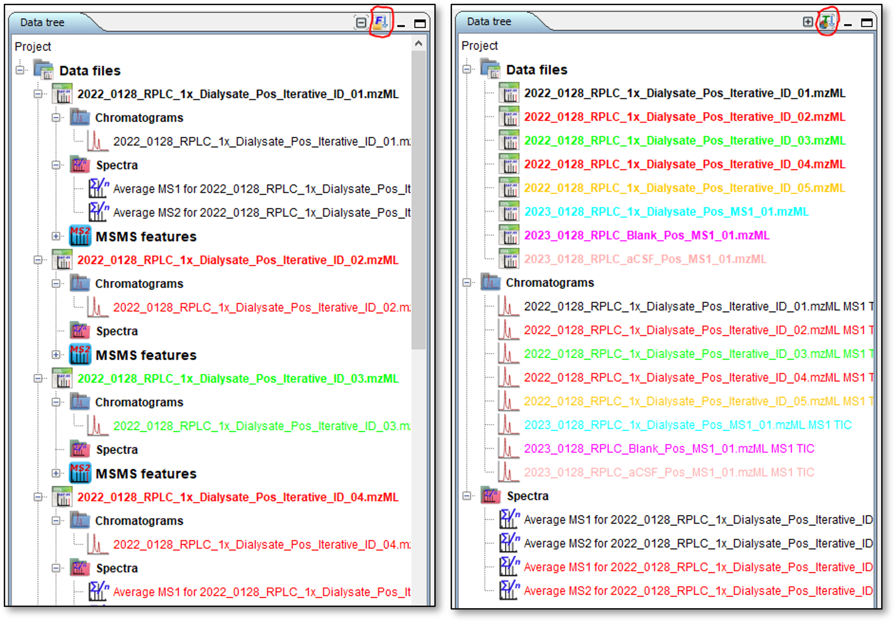
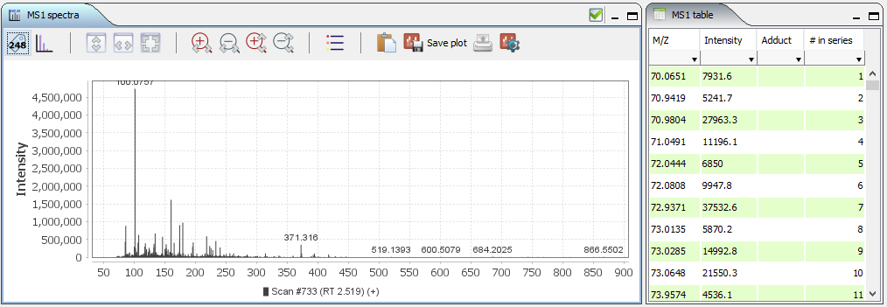
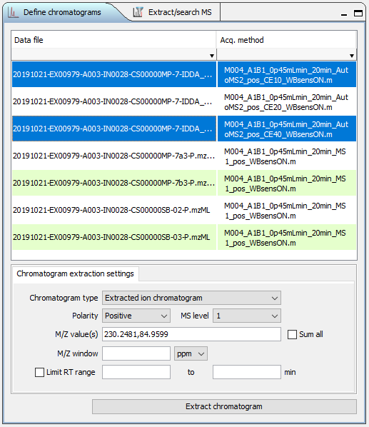
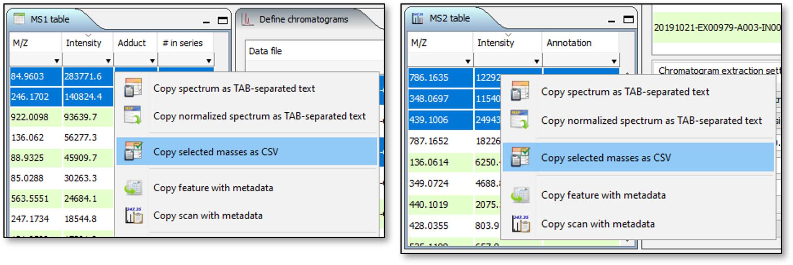
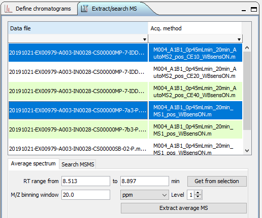
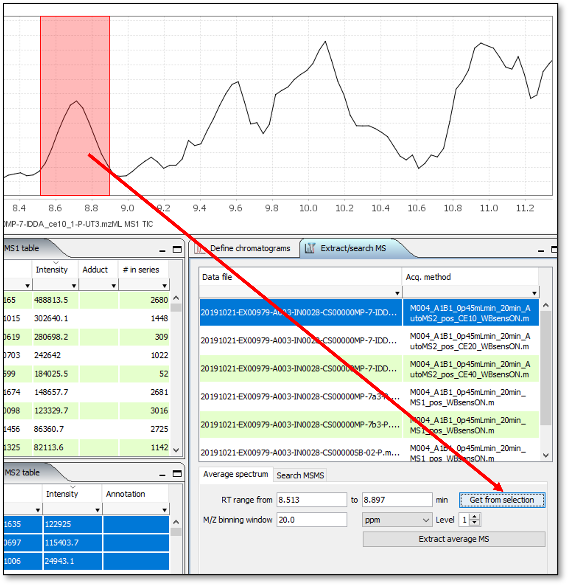
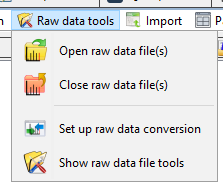
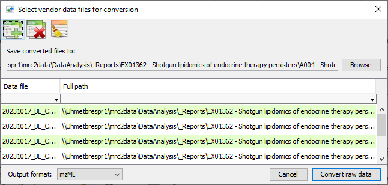
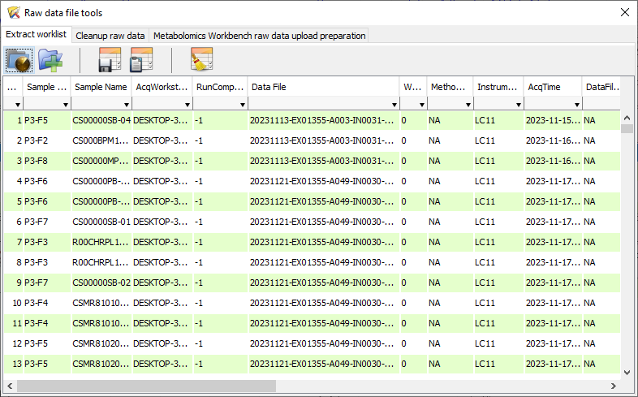
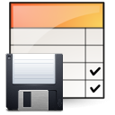

Raw Data Examiner panel ([Fig. 1](#raw_data_examiner_panel)) provides the basic functionality to explore the raw MS and MSMS data.It works both with arbitrary mzML and mzXML files and in the context of compound identification experiment.

 

{#raw_data_examiner_panel}

 

## Data tree panel

Data tree panel ([Fig. 2](#raw_data_file_tree)) shows the currently loaded raw data files and chromatograms / spectra linked to them.

 

{#raw_data_file_tree}

 

Control buttons at the right side of the panel header allow to expand / collapse Chromatogram and Spectra tree nodes ({height="24px" width="24px"} / {height="24px" width="24px"}), and toggle between grouping tree nodes by file or by data type ({height="24px" width="24px"} / {height="24px" width="24px"}). Other sub-panels of the Raw Data Examiner will show relevant information depending on which data tree node is selected.

 

## Scan navigator panel

Scan navigator panel ([Fig. 3](#raw_data_scan_navigator_panel)) is listing the scans for the currently selected raw data file. It lists scan number, retention time, MS level, polarity. For MSMS scans it also lists parent ion M/Z and isolation window (Range). All table columns allow sorting and filtering. Clicking on MS1 scan will display it on MS1 spectra plot and in MS1 table ([Fig. 3](#msOne_spectra_plot_and_table)). If there are any child MSMS scans associated with currently selected MS1 scan, the first MSMS scan following MS1 will display on MS2 spectra plot and in MS2 table ([Fig. 5](#msTwo_spectra_plot_and_table)). Clicking on MSMS scan will display it together with parent MS1 scan on the corresponding plots and tables. When TIC or BPC are displayed in the chromatogram panel, the position of the selected scan will be indicated by a vertical blue line.

 

{#raw_data_scan_navigator_panel}

 

{#msOne_spectra_plot_and_table}

 

{#msTwo_spectra_plot_and_table}

 

## Data file properties

Data file properties panel ([Fig. 6](#raw_data_file_properties_panel)) is listing the properties of raw data file as recorded in mzML / mzXML.

 

{#raw_data_file_properties_panel}

 

## Extracting chromatograms

 

{#chromatogramExtractionSetupPanel}  

To extract various types of chromatograms use "Define chromatograms" panel ([Fig. 7](#chromatogramExtractionSetupPanel)) to specify the parameters:

-   Select one or more data files in the table
-   Choose chromatogram type (TIC, BPC or extracted ion)
-   Choose MS level
-   Specify m/z window for XIC extraction (numerical value and units of measure)
-   Change polarity if necessary (not automated yet)
-   For extracted ion chromatogram (XIC) type in one or more m/z values separated by comma, check "Sum all" if you want cumulative XIC, otherwise separate XICs will be extracted for each m/z value.
-   If you want to limit RT range, specify lower and upper limits and check "Limit RT range" checkbox
-   Click "Extract chromatograms".

All settings except data file selection are preserved across sessions.

You may copy one or more M/Z values from MS1 or MS2 tables as comma-separated text ([Fig. 8](#copyMassesForXICextraction)) and paste them into "M/Z values" field instead of manually typing.

 

{#copyMassesForXICextraction}

 

## Extracting average mass spectrum

To extract average MS or MSMS over selected RT span use Chromatogram extraction setup panel ([Fig. 9](#averageMSExtractionSettingsPanel)) to specify the parameters.

 

 

To extract average MS:

-   Select data file(s) from the data file table
-   Specify retention range (manually or from selection on the chromatogram panel ([Fig. 10](#getMSaveragingRangeFromSelection)). To select the range on a chromatogram, hold the "Shift" button, press the left mouse button, drag the mouse across the desired range and release the mouse button. To clear selection shift-click anywhere in the chromatogram panel.
-   Specify m/z window for peak averaging
-   Specify MS level (1 - MS1, 2 - MS2, etc.)
-   Click "Extract average MS"

 

 

## Raw data tools

Raw data tools are accessible from the "Raw data tools" menu ([Fig. 11](#rawDataToolsMenu))

 

 

### Open/Close raw data files

These option may be used to visually examine MS data files in mzML or mzXML format (generate chromatograms, browse spectra, etc.). When raw data files are opened, TIC is extracted automatically.

The options are not available when there is an active raw data analysis project.

### Raw data conversion

To batch-convert raw data from vendor format to open format IDTracker has a built-in user interface for msconvert ([Fig. 12](#rawDataConverterDialog)). To run the raw data conversion you will need to specify the location of msconvert.exe file in the preferences (see above). Msconvert is part of the ProteoWizard package and may be downloaded [here](https://proteowizard.sourceforge.io/download.html). The number of conversions run in parallel is determined by the "Maximal number of tasks" value in the program preferences. The coversion includes vendor peak picking but doesn't apply any additional filters to maximally preserve the data on all available MS levels.

 

 

### Auxiliary raw data tools

This set of tools is designed to help with some common tasks during data analysis and report preparation. At the moment it only can handle Agilent .D data files. To display the tools dialog ([Fig. 13](#auxRawDataTools)) select "Show raw data file tools" from raw data tools menu.

 

 

#### Extract worklist

This panel ([Fig. 13](#auxRawDataTools)) allows to extract the data acquisition worklist form the directory containing a set of Agilent .D data files. The search for data files in non-recursive (the subfolders that may contain additional .D files are ignored). You may generate new worklist ({height="24px" width="24px"}), add more data files to the list ({height="24px" width="24px"}), save worklist to file ({height="24px" width="24px"}), copy it to clipboard ({height="24px" width="24px"}), or clear the list ({height="24px" width="24px"}).

 

#### Cleanup raw data

 

#### Metabolomics Workbench raw data upload preparation

 
