LIMS stands for Laboratory Information Management System. Its purpose is to provide a database back end and friendly user interface for managing multiple kinds of data associated with MSMS experiments ([Fig. 1](#tracker_lims_panel)).

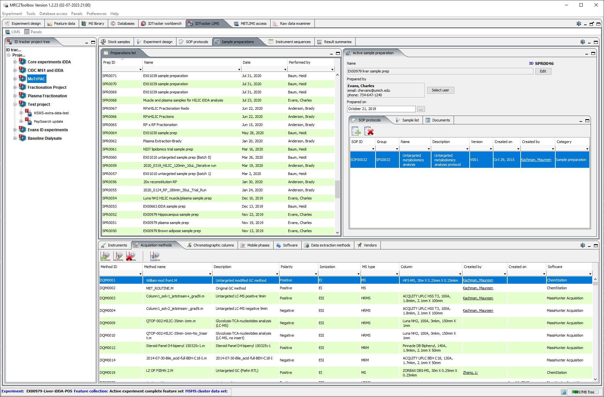{#tracker_lims_panel}

# Projects and experiments

## Project configuration

Projects allow the grouping of related identification experiments. Every experiment has to be associated with the project. To create the new project, go to "LIMS" menu of the "MetIDTracker LIMS" panel and select "New MetIDTracker project" command to display the Project Editor Dialog ([Fig. 2](#tracker_project_editor)).

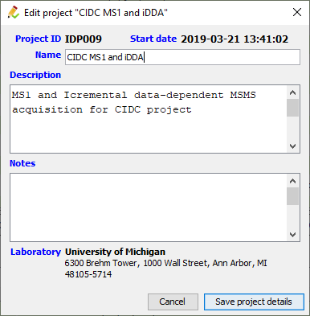{#tracker_project_editor}

The name is obligatory, description and notes are optional, Project ID, start date and laboratory are populated automatically based on the currently logged-in user data.

To edit project information, select it in the tree, right-click and choose "Show Edit compound identification project" from the popup menu ([Fig. 3](#project_context_menu)).

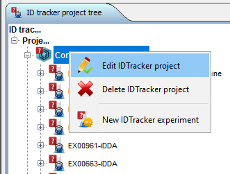{#project_context_menu}

## Experiment configuration

Creation of the experiments and data upload to the central repository are described in separate tutorials ([here](offline_experiment_tutorial.html) and [here](db_experiment_from_offline_tutorial.html)). To edit some basic experiment information, select the experiment in the tree, right-click and choose "Show Edit compound identification project" from the popup menu ([Fig. 4](#tracker_experiment_context_menu)) to show Experiment Editor Dialog ([Fig. 5](#tracker_experiment_editor_dialog)).

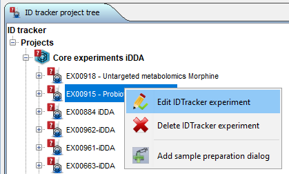{#tracker_experiment_context_menu}

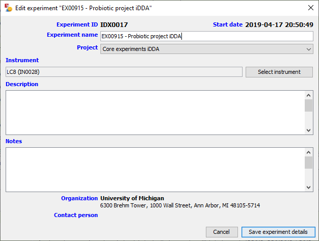{#tracker_experiment_editor_dialog}

# Data acquisition and analysis

## Vendor manager

Vendor manager ([Fig. 6](#vendor_manager_panel)) allows the user to enter and edit ([Fig. 7](#vendor_editor)) some basic information about the hardware and software manufacturers. These data are required to properly track instruments, software and a number of other items in the LIMS.

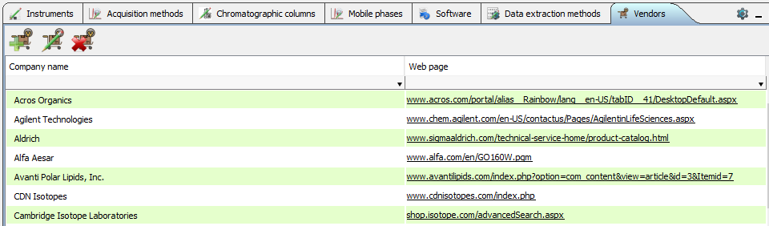{#vendor_manager_panel}

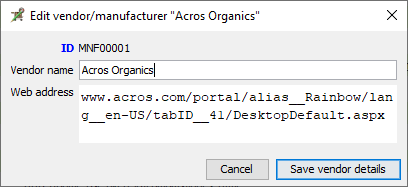{#vendor_editor}

## Instrument manager

Instrument manager ([Fig. 8](#instrument_manager_panel)) allows the user to enter and edit some basic information about the LC-MS and GC-MS instruments used to perform the analysis ([Fig. 9](#instrument_editor_dialog)).

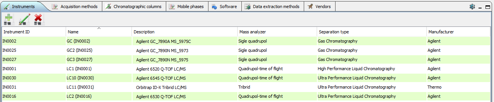{#instrument_manager_panel}

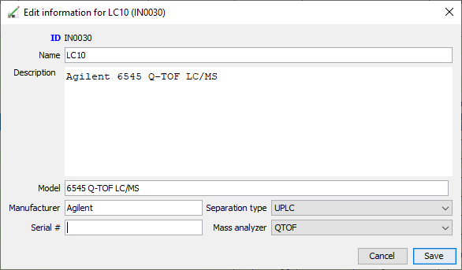{#instrument_editor_dialog}

## Chromatographic columns manager

Chromatographic columns manager ([Fig. 10](#chromatographic_column_manager)) allows the user to keep an inventory of columns used for sample separation - add, edit ([Fig. 11](#chromatographic_column_editor)), delete columns.

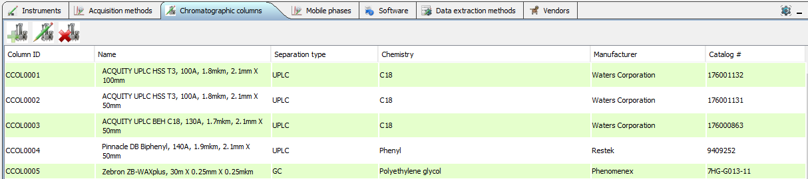{#chromatographic_column_manager}

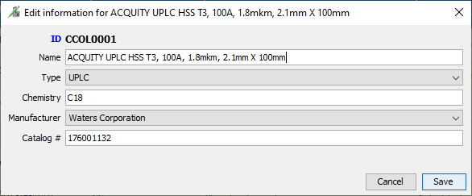{#chromatographic_column_editor}

## Mobile phase manager

The mobile phase manager [Fig. 12](#mobile_phase_manager) keeps an inventory of mobile phases used for the chromatographic separation of compounds and allows to add, edit ([Fig. 13](#mobile_phase_editor)) or delete mobile phase components.

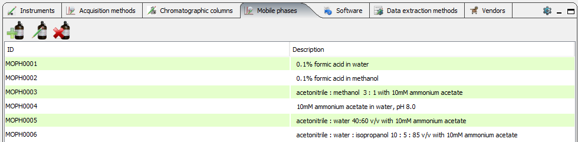{#mobile_phase_manager}

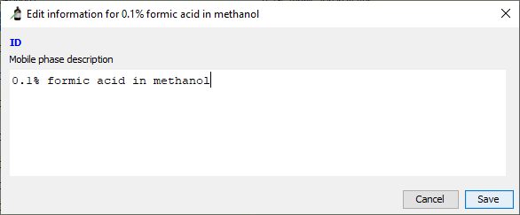{#mobile_phase_editor}

## Software manager

Software manager ([Fig. 14](#software_manager_panel)) allows the user to enter and edit ([Fig. 15](#software_editor)) some basic information about instrument control and data analysis software. It is required to properly define and track data acquisition and data analysis methods in the LIMS.

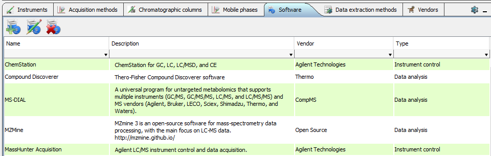{#software_manager_panel}

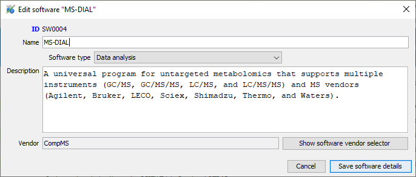{#software_editor} Part of software definition is vendor selection through vendor selector dialog ([Fig. 16](#vendor_selector)).

{#vendor_selector}

## Data acquisition method manager

Data acquisition method manager ([Fig. 17](#data_acquisition_method_manager)) is intended to maintain the list of instrument (LC-MS and GC-MS) methods. Method files are stored in the database together with some descriptive information and may be downloaded for re-use in new studies.

{#data_acquisition_method_manager}

Data acquisition method editor ([Fig. 18](#data_acquisition_method_editor)) allows the user to specify several parameters for the method. Gradient and mobile phase definition are not fully implemented yet, so the corresponding panels are hidden on the figure. For definition of the new method all fields are obligatory.

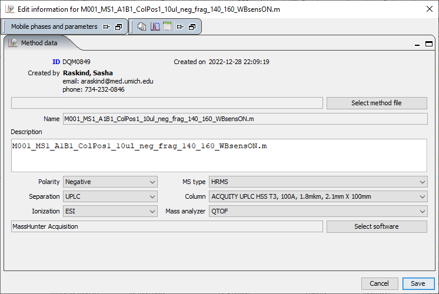{#data_acquisition_method_editor} Part of acquisition method definition is software selection through software selector dialog ([Fig. 19](#software_selector)).

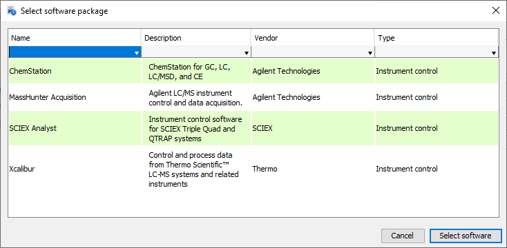{#software_selector}

## Data extraction method manager

Data extraction method manager ([Fig. 20](#data_extraction_method_manager)) is intended to maintain the list of vendor or third-party methods used to extract MS and/or MSMS data from raw data files. Method files are stored in the database together with some descriptive information and may be downloaded for re-use in new studies.

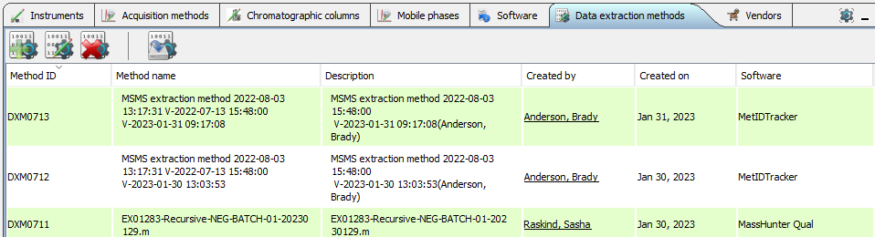{#data_extraction_method_manager}

Data extraction methods are highly diverse and difficult to classify in a meaningful way, so only a field for free-form description is provided ([Fig. 21](#data_extraction_method_editor)).

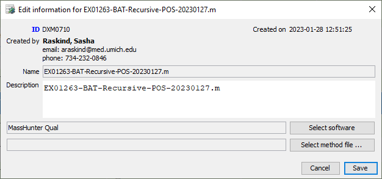{#data_extraction_method_editor}

## SOPs and protocols manager

The SOPs and protocols manager ([Fig. 22](#sops_manager_panel))maintains a library of standard procedures and protocols of different categories. Documents are stored in the database together with some descriptive information and may be downloaded as needed.

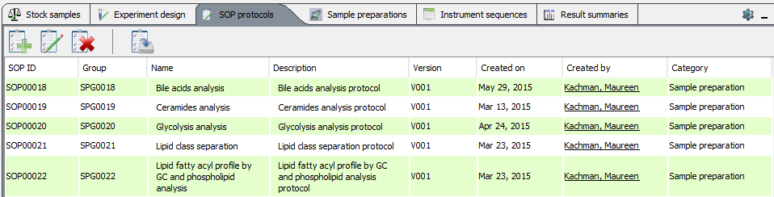{#sops_manager_panel}

To upload new or edit existing SOP document use SOP/Protocol editor ([Fig. 23](#sop_editor)). Protocol name, category, description, and document file must be specified to define a new protocol. Other fields are auto-populated . If the document file is specified when editing the protocol, it will replace the document currently associated with the protocol ID.

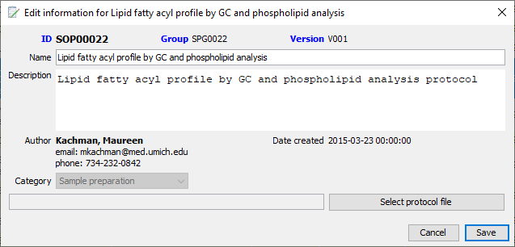{#sop_editor}

## Stock samples manager

Compound identification experiments are often performed using multiple aliquots of the same sample for analysis under different chromatographic and MSMS conditions. Stock samples manager ([Fig. 24](#stock_sample_manager_panel)) is designed to maintain the list of these samples.

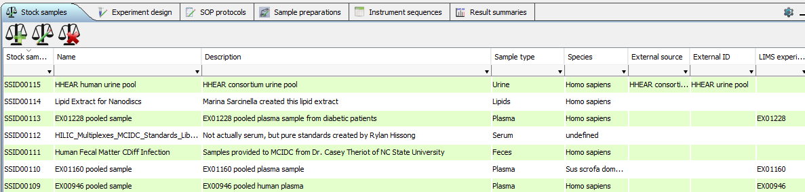{#stock_sample_manager_panel}

To define the new stock sample it is necessary to specify name, description, type and species ([Fig. 25](#stock_sample_editor)).

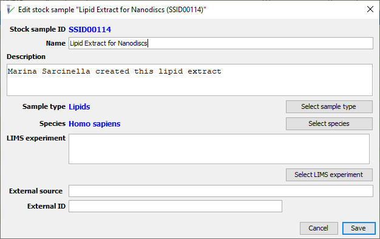{#stock_sample_editor}

Sample types are selected ([Fig. 26](#sample_type_lookup_dialog)) from the list based on [NCBI MESH term list](https://www.ncbi.nlm.nih.gov/mesh/).

{#sample_type_lookup_dialog}

Species are selected ([Fig. 27](#species_lookup_dialog)) from [NCBI taxonomy list](https://www.ncbi.nlm.nih.gov/taxonomy).

{#species_lookup_dialog}

## Sample preparation manager

Sample preparation manager has two parts - the list of all sample preparations ([Fig. 28](#sampllePrepListTable)) and the linked editor panel ([Fig. 29](#samplePrepEditor)).

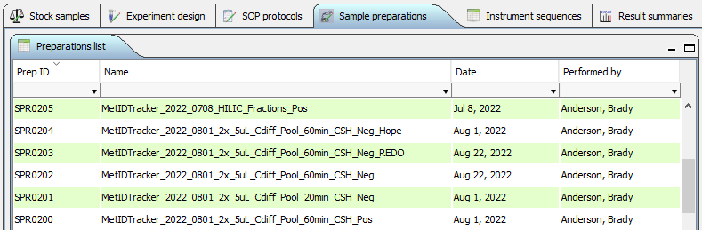{#sampllePrepListTable}

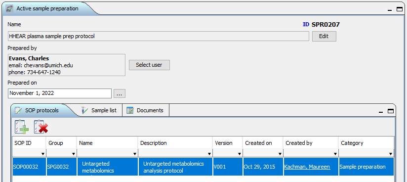{#samplePrepEditor}

To view or edit sample preparation details select it in the table. All sample preparation details may be edited except the list of the samples.

## Instrument sequences panel

Instrument sequences panel ([Fig. 30](#experimentWorklistInTracker)) is populated when the experiment is selected in the project tree.It allows to view and export data about sample run order, acquisition methods, injection volumes, etc.

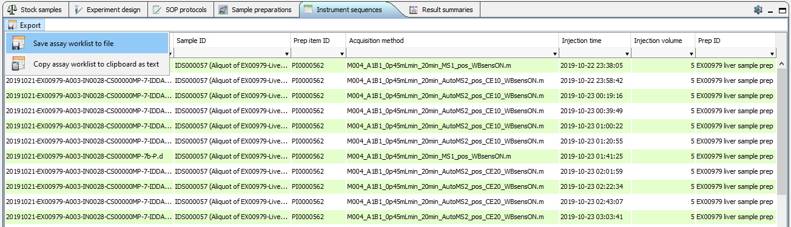{#experimentWorklistInTracker}

## Data summary panel

This feature is still under development. The section of the manual will be updated once the functionality is in place.
