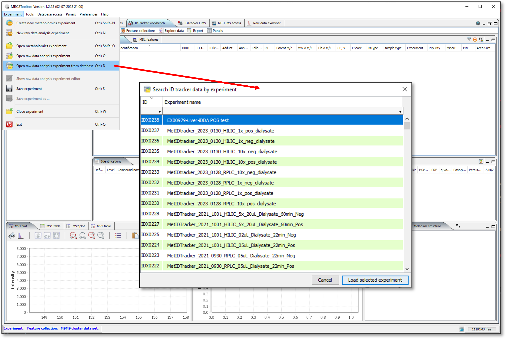
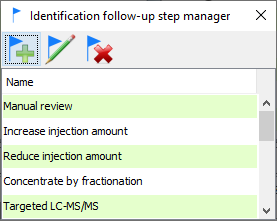

# Overview

IDTracker workbench panel provide the instruments to retrieve experimental data from the database, annotate the features through using several different approaches and generate various reports.

# Data retrieval

There is a number of ways to retrieve the data from individual or multiple experiments for further analysis:

## Offline raw data analysis projects

## Database stored projects

To load the complete data set for a single experiment use "Open raw data analysis experiment from database" command from the "Experiment" menu ([Fig. 18](#loadExperimentFromDatabase)).

{#loadExperimentFromDatabase}

To load experiment either double-click on it or select the experiment and click "Load selected experiment" button. If experiment contains the data for both positive and negative mode, both would be loaded.

## Data retrieval using database search

The amount of data in ID tracker and the number of parameters has increased since the original search form was created, and it became apparent that a more comprehensive and flexible searching mechanism was required. At the moment, the search is functional for MS2 data only.

The search form is a separate dialog called by clicking the  button on the tracker toolbar (first on the left side). The dialog has five panels for different search parameter groups. Setting specific values to any parameter on any panel will narrow the search results. You may reset all the parameters on all panels using the "Reset form" button at the bottom of the dialog or reset individual panels using the "Reset to default values" button. All parameters are preserved between search sessions.

Search parameters may be saved and loaded to/from database using the load () and save () buttons on dialog toolbar:

You may either click the "Load selected query ..." button or double-click the line in the table to load the selected parameter set. You may load other user's parameters, but you may delete only those that you created yourself. To create a new set, click  button, give a descriptive name in the dialog and click "Save".

### LC-MSMS related options

On the MZ/RT search panel you can specify the precursor M/Z, one or more fragment masses, polarity, MS depth, collision energy and retention range. As within the original search, checking "Ignore M/Z" will disregard any precursor/fragment data.

### Sample and experiment options

You may limit the search to one or more sample type(s)/experiment(s) by selecting one or more lines in each of the tables. You may sort and filter the tables to find the necessary data. To clear selections click "Reset to default values".

### ID and annotations options

-"Filter by identification status" defaults to "All", but you may change it to select only identified or only unknowns. -"Filter by name or ID" works the same way as in the original search. -"Filter by formula" - search by molecular formula -"Filter by InChiKey" - search by complete InChiKey or by the first section (14 characters before the first dash that encode structure without any stereo information, e.g. D/L, R/S compounds will have the same first 14 characters)

Check "Search all identifications" to search all IDs in the database. If left unchecked, only primary/default IDs will be considered

"Only features with annotation" - limit to features with custom manual annotations (NOT ID levels and follow-up steps)

Select any combination of ID levels and follow-up steps in the corresponding tables

### Data acquisition and data extraction options

Allows multiple selections in each table.

### MSMS Library options

Limit search results to hits from specific MSMS libraries and /or specific library entries (you may use NIST ID, MONA ID etc.).

"Search all matches" will consider all library hits, not only the default IDs.

## Exporting results

### Exporting MSMS features in TAB-delimited format

To export the features first run the search to populate MS2 and/or MS1 feature tables.

Click the button "Show ID tracker data export dialog" (marked above) to call the export setup dialog. The drop-boxes on the top of the dialog allow to select the subset of features to export:

-   MS level - MS1 or MS2

-   Feature subset

    -   All - all features loaded after search was competed
    -   Filtered - only features visible in the table if any of the filters in the table header were used
    -   Selected only - only those selected by the user in the feature table

-   Identification status

    -   All
    -   Identified only
    -   Unknowns only

There are two lists of parameters available for export - feature properties and identification properties. Columns will be created in the export file for all selected fields and data added where available. To change the field selection hold the "Control" button and click on the field to select/deselect. You may reset the selection to default values using the button below the lists. Your current selection will be preserved between sessions.

Use the "Browse" button to set the export file name and location, then click "Export MetIDTracker data" to write out the export file.

### Exporting MSMS features in NIST MSP format

Click on the  button on the MetIDTracker Workbench panel toolbar. If no MSMS features are selected in the table, the prompt will pop up asking whether you want to export all of the features in the table followed by the file explorer to select the export destination. If some MSMS features are selected in the table, only those features will be exported to the specified file.

### Exporting MSMS features in SIRIUS MS format

[SIRIUS](https://bio.informatik.uni-jena.de/software/sirius/) software package provides a set of tools for MSMS interpretation and compound identification through MSMS. SIRIUS results are more reliable when multiple MSMS data for the same compounds are interpreted together (e.g. multiple fragmentation energies). The SIRIUS export function allows the grouping of selected MSMS features by the M/Z of the precursor ion and retention time based on specified tolerances.

Click on the  button on the MetIDTracker Workbench panel toolbar to show the SIRIUS data export dialog (423).

23.23 *SIRIUS data export dialog*

Specify filters to limit the set of features to export and adjust m/z and RT grouping windows if necessary. Choose the destination file and click "Export data". The resulting file in MS format is ready for import into SIRIUS for further analysis.

## ID tracker feature identification parameters

### ID status flags

To consider the cases where feature were identified by automated searches against spectral libraries/databases, but were rejected by manual curation the "Ambiguity" column is replaced by the "ID status" column which has one of the following icons:

 Single active ID

 Single ID, rejected by curator (table cell will have gray border)

 Multiple IDs, one set as default

 Multiple IDs, NONE set as default (table cell will have gray border)

 True unknown

24.24 *How to disable default id*

Right-click anywhere in the identification table and select "Disable primary identification" from the popup (424). The ID radio-button will clear and the icon in the feature table will change accordingly. To assign the ID click on the corresponding radio button in the identification table. The database response is still sluggish, so please wait for GUI to update properly.

24.24 *Identification table popup menu*

### ID certainty levels

ID certainty levels are for internal use and do not have any direct relation to established ID confidence levels specified by different metabolomics consortia. Levels are color-coded for easier visualization, colors are user-specified. The values are assigned not to the feature, but to its default identification. If there is a default ID, the info will be shown both in the feature table and in the identifications table. If the default ID is disabled, the corresponding cell in the feature table will be blank.

#### Managing ID certainty levels

There is a list of pre-defined identification levels. It may be edited and expanded using the Identification Level Manager (425). You may call the manager by clicking the  icon on the MetIDTracker workbench toolbar.

25.25 *Identification Level Manager*

You may add, edit, or delete ID levels steps using the Identification Level Editor dialog (426). To edit or delete the level it should be highlighted in the manager. The editor dialog allows the user to specify name, numerical rank, and color code for the level. The lower the rank, the higher ID confidence.

26.26 *Identification Level Editor dialog*

#### Assigning ID certainty level

Select the identification in the "Identifications" table and right-click to show the popup menu. Select "Set ID confidence level" -> desired level (427).

27.27 *Setting ID confidence level*

### Follow-up steps

#### Managing follow up steps

There is a list of pre-defined follow-up steps. It may be edited and expanded using the Follow-up step manager (428). You may call the manager by clicking the  icon on the MetIDTracker workbench toolbar:

28.28 *Follow-up step manager*

You may add, edit, or delete follow-up steps using the Follow-up Step Editor dialog (429). To edit or delete the follow-up step it should be highlighted in the manager.

29.29 *Follow-up step editor*

#### Assigning follow-up steps to the feature

Select the feature in MS1 or MS2 table and right-click to show the popup menu. Select "Assign follow-up steps to feature" (430) to show the "Edit identification follow-up steps ..." dialog (431).

30.30 *MSMS feature popup menu*

The dialog will show:

31.31 *Edit identification follow-up steps dialog*

If any follow-up steps were already assigned to the feature they will be on the right side. Move items around by selecting them and clicking add/remove buttons in the middle. Click "Save" to send the new selection to the database. If the feature has at least one follow-up step it will be flagged in the "Follow-up" column and assigned steps will be listed in the "Follow-up" table (432).

32.32 *Identification follow-up step display*

### Free form and document-linked annotations

It is possible to attach extended annotations to MSMS features. In annotation manager (433) you may create formatted text annotations that may include pictures and attach documents as annotation (e.g. pdf or PowerPoint).

33.33 *Annotation manager*

To create a new free-form annotation click  icon on the annotation manager toolbar to show "Edit annotation" dialog (434). The editor allows the user to format the text in various ways and add pictures by copying/pasting or selecting a file on the disk.

34.34 *Free form annotation editor*

To attach a document, click the  icon on the annotation manager toolbar to show the "Attach document annotation" dialog (435). Use the "Browse" button to select the document. By default, the title is set to the document file name, but you may change it to a more meaningful name if necessary.

35.35 *Attach document annotation dialog*

Double-click on the annotation in the table to view or edit it. Free-form annotations will be opened in the editor, PDF or PowerPoint documents will open in a built-in viewer.

To download the annotation document, select it in the table and click the  icon on the annotation manager toolbar.

### Standard annotations

Standard forms of annotation (ID level and follow-up steps) can be applied only to the identified features since they are associated with feature ID but not with the feature itself. Unknown features may be annotated by typing in free form comments, but it is time consuming and more difficult to search and summarize later. For this reason, MetIDTracker includes an option to add "Standard annotations" to any feature regardless of identification status. It works the same way as "Follow-up" steps. To add one or more standard annotations select the feature in the table, right-click to display the context menu and select "Assign standard feature annotations to feature" (436) to show the "Edit standard annotations for selected feature" dialog (437).

36.36 *Invoking standard annotation assignment dialog*

37.37 *Feature standard annotation editor*

Use "Add" and "Remove" buttons in the middle of the form to move the annotations between "Available" and "Assigned" lists. Click "Save" to commit the changes to the database.

Standard annotations manager (438) allows users to add new or edit existing annotations. To show the standard annotations manager click the  icon on the ID tracker workbench toolbar. Available annotations will be listed in the table. All users may add new annotations and edit code and the description for existing annotations using Standard Annotations Editor (439). You need administrative privileges to delete the annotation as it is with other data types in the tracker.

38.38 *Standard annotations manager*

39.39 *Standard Annotations Editor*

For now, standard annotations are shown the same way as follow-up steps - using a separate table on the workbench panel. There also will be a flag in the "Annotations" column.

## Custom feature collections

MetIDTracker has extensive feature search capabilities. There is also an option to create custom collections of features that can be preserved between sessions and loaded on demand.

### Feature collection manager

Feature collection manager (*440*) allows to create new empty feature collections or to create collections from external lists of features. The latter may be necessary if some analysis was performed by software tools not integrated with Tracker. Feature collection manager is called by clicking the  icon on the MetIDTracker workbench toolbar.

40.40 *Feature collection manager*

Collections "Current MS1 feature search" and "Current MSMS feature search" hold the results of the latest corresponding database searches. The MS1 portion doesn't have almost any functionality yet, so for now it is just a placeholder. For now, any user can create new and edit existing collections, but only the admin or the person who created the collection can delete it.

To load a collection in the workbench panel for analysis double-click on it in the table or select and click the "Load selected ..." button on the toolbar. To go back to the last database search results, load the "Current MSMS feature search" collection or click the "reload" icon  on the MSMS table toolbar (*441*).

41.41 *Reload latest database search results for MSMS features*

### Creating new collections

New MSMS feature collections can be created in three ways:

-   From the feature collection manager (empty, or reading feature ID list from file)
-   From features selected on MZ/RT plot
-   From features selected in the MSMS features table.

#### Creating feature collection using manager

In the feature collection manager click the "New collection" icon on the toolbar to show the collection editor dialog (*442*), specify name and description (optional), check "Load collection in the workbench", if you want to activate the collection for analysis right away, and click the "Create new empty feature collection" button.

42.42 *Feature collection data editor*

If you want to create the new collection from an external list of feature IDs, you may specify the file containing the list using "Browse..." button. The file should be plain text with txt, csv or tsv extension. It has to contain a single column of MSMS feature IDs, one per line. The format of MSMS feature ID is MSN_XXXXXXXXXXXX (MSN\_ followed by 12 digits), they are included in the standard MetIDTracker export file. Any line in the file that doesn't match the ID format will be ignored. The IDs in valid format will also be checked against the database and if any of them are not present anymore, (features deleted from database), they also will be ignored. The final count of valid feature IDs will be shown at the end of file import (*443*). Check "Load collection in the workbench", if you want to activate the collection for analysis right away and click the "Create new feature collection with selected features" button to complete the process.

43.43 *Creating MSMS feature collection from the list of IDs*

#### Creating new feature collection from MZ-RT plot

To select the features for collection, zoom to the region of interest, if necessary, then press and hold "Shift", press the left mouse button and drag the mouse to highlight the features of interest. Release the mouse button and then release the "Shift" key. To clear the selection Shift-click on the plot. If you make a new selection, the old one is cleared automatically. Right-click on the highlighted region to show the context menu and select "Create new collection..." (*445*) to show the "Create new feature collection" dialog (*442*).

44.44 *Create collection from features selected on MZ/RT plot*

To display only the selected features in the MetIDTracker workbench panel without creating the collection, choose "Filter selected ..." from the context menu.

#### Creating new feature collection from MSMS feature table

To create a new collection from the MSMS feature table select the features, right-click on the table to show the context menu and choose "Create new collection from selected features" (*445*) to show "Create new feature collection" dialog (*442*).

45.45 *New collection from features selected in the table*

Adding features to existing collections

MSMS features can be added to existing collections in three ways:

-   From feature collection manager (reading feature ID list from file)
-   From features selected on MZ/RT plot
-   From features selected in the MSMS features table

#### Adding features using feature collection manager

Select target collection in the manager table and click the "Edit collection" icon on the toolbar. Select the file containing the list of MSMS feature IDs (see above for the file format details). Edit feature collection name and description, if necessary, check "Load collection in the workbench", if you want to activate the collection for analysis right away and click the "Save" button. #### Adding features using MZ-RT plot To select the features for collection, zoom to the region of interest, if necessary, then press and hold "Shift", press the left mouse button and drag the mouse to highlight the features of interest. Release the mouse button and then release the "Shift" key. To clear the selection Shift-click on the plot. If you make a new selection, the old one is cleared automatically. Right-click on the highlighted region to show the context menu and select "Add selected features to existing collection..." to show the "Add features ..." dialog (*446*). Select the target collection, check "Load modified collection in the workbench", if you want to activate the collection for analysis right away and click the "Add features to selected collection" button.

46.46 *Add features to existing collection dialog*

#### Adding features using MSMS feature table

To add features from the MSMS feature table select the features, right-click on the table to show the context menu and choose "Add selected features to existing collection..." to show the "Add features ..." dialog (*446*). Select the target collection, check "Load modified collection in the workbench", if you want to activate the collection for analysis right away and click the "Add features to selected collection" button.

#### Removing features from collection

To remove the features from a collection, load the collection into the workbench panel, select the features you want to remove, right-click on the table to show the context menu, choose "Remove selected features from active feature collection" and confirm removing the features.

## Searching MSMS libraries

MetIDTracker allows users to search the experimental features against MSMS libraries using NIST MSPepSearch.

The software is available [here](https://chemdata.nist.gov/dokuwiki/doku.php?id=peptidew:mspepsearch) Please use "Current release (02/22/2019, with new hybrid and hi-res searches, no GUI)". MSPepSearch doesn't require installation, just unpack the archive in your preferred location on the disk and set the location of the executable in MetIDTracker preferences.

MSMS libraries have to be modified and formatted in a specific way so that the search results may be uploaded to the MetIDTracker database and properly linked to the library entries and compound information. Several libraries ready to use with MetIDTracker are provided for download [here](https://github.com/araskind/MRC2Toolbox#msms-libraries):

-   [MS-DIAL metabolomics MSP spectral kit, VS15, positive mode](https://umich.box.com/s/4p6usq555ab5f46l4bgheigamlbxvj95)
-   [MS-DIAL metabolomics MSP spectral kit, VS15, negative mode](https://umich.box.com/s/2drqabukveaog1ers89qcu3qx9uocfie)
-   [MS-DIAL LipidBlast, V68, positive mode](https://umich.box.com/s/dat5kj9xafg6z4qw4vnju9v1z01drsg9)
-   [MS-DIAL LipidBlast, V68, negative mode](https://umich.box.com/s/gm4yf920uad53wpqv1gvsk82epxd2t4w)

All libraries are in NIST format. Extract the archives and place the library folders in your preferred location on the disk.

### MSMS search setup

To call MSPepSearch setup dialog (447) click  icon on the MetIDTracker workbench panel toolbar. If you want to run the search without uploading the results to MetIDTracker database, click  icon. The search setup procedure is identical in both cases.

47.47 *PepSearch setup options*

#### Search options

"Search options" (447) defines the parameters of the search algorithm. The GUI is a front-end to the MSPepSearch command line options and implements most of the functionality, except the options related to the search against unit-mass resolution GCMS libraries. For details regarding specific parameters please consult the MSPepSearch Readme file and NIST MSSEARCH manual.

#### Input data and libraries

"Input data and libraries" (448) is used to specify the source of experimental MSMS spectra and the set of MSMS libraries to use in the search. "Internal" input means that the set or subset of MSMS features currently active in MetIDTracker will be searched against the specified libraries. The subset of features is determined by the option selected in the "For internal data" dropdown menu. "All" means all features in the currently active feature collection. "Filtered" means all features visible in the MSMS feature table (relevant when at least one data filter is applied to the table). "Selected only" - only features selected in the table will be used. Selected subset of features will be written out in NIST MSP format to the MetIDTracker \data\mssearch directory. If the "File" input data source is selected, use the "Browse" button to select the MSP input file.

Use the Add/Remove library buttons to manage the list of libraries. Libraries should be in NIST format. Libraries that were not properly integrated with MetIDTracker still can be searched, but results cannot be uploaded. The MSPepSearch output file will be written out to MetIDTracker \data\mssearch directory.

48.48 *PepSearch input data and libraries*

Use the checkboxes in the "Enabled" column to control which libraries should be used for the search.

#### Output options

"Output options" (450) set result filters (minimal match factor and maximal number of hits per feature) and the types of data included in the output file. The latter is only important in case you are planning to review search results directly, without uploading to MetIDTracker.

#### Command preview

"Command preview" (449) allows the user to generate and copy the actual MSPepSearch command based on the options specified in other panels.

49.49 *PepSearch command preview*

50.50 *PepSearch output options*

Click "Search NIST MSMS libraries" button to start the search. Depending on the size of the dataset, libraries, and search parameters it may take significant time, especially for "In-source" and "Hybrid" search modes.

## Adduct and fragment assignment

### Adding and editing new adducts

The system for handling adducts and fragments was redesigned and significantly enhanced. All adducts now fall into two groups:

-   Simple, or charge carriers (M+H, M-H, M+Na, M+Cl, etc)
-   Composite - a combination of charge carrier and one or more neutral loss and/or "Repeats" (neutral additions, e.g. formic acid, sodium formate, etc.)

Simple and composite adducts are now created and edited separately. To create a new simple adduct, neutral loss or repeat click the first button on the adduct manager toolbar (*451*, marked by red circle)

51.51 *Simple adduct editor*

Editable fields on the form and some values will be automatically adjusted depending on the selected category of modification (for repeats only "Added group" is allowed, for neutral losses - only "removed group", etc.). For complex neutral losses you may now specify the structure using a SMILES string.

To create a new composite adduct call the composite adduct editor on the adduct manager toolbar (*452*, marked by red circle)

52.52 *Composite adduct editor*

In order to create new composite adduct you have to first define the charge carrier (click "Select charge carrier" and choose one from the table that pops up). Then you must add at least one neutral loss or neutral adduct (repeat) using the corresponding buttons. For the cases when there is more than one loss or repeat of the same kind you will have to add each modification separately. The name for a new adduct will be created automatically based on the names of the building blocks, but you may add your own description if necessary.

To edit an adduct select it in the adduct manager table and click the "Edit adduct" button on the toolbar. Depending on the type of adduct (simple or composite) the appropriate dialog will show pre-populated with the data for selected adduct.

### Assigning adduct to feature

By default all the features are assigned simple charge carriers based on their charge (\[M+H\]+, \[M+2H\]2+, \[M+3H\]3+, \[M-H\]-, \[M-2H\]2-, \[M-3H\]3-).

It is now possible to manually assign any adduct from the list in the database to any identified feature. You may select any feature and use contextual popup menu to call manual identification dialog (*453*).

53.53 *Manual identification assignment dialog*

By default, precursor M/Z for MSMS feature and default adduct for charge will be selected in the adducts table. If the feature was previously identified and assigned a different adduct, it will be selected in the table instead. To look up the compounds in the database by neutral mass based on M/Z and selected adduct click the "Search" button under the adducts table. You may use other fields in the search form to narrow down the search. The fields are additive (the more different search parameters you specify the more filters are applied to search results). You may exclude searching by mass altogether by clearing the mass field. After the search is completed you may select one of the entries in the "Database search results" table and click the "Assign selected identification" button to set it as a default identity for the selected feature. The adduct selected in the adducts table will be also assigned as default.
